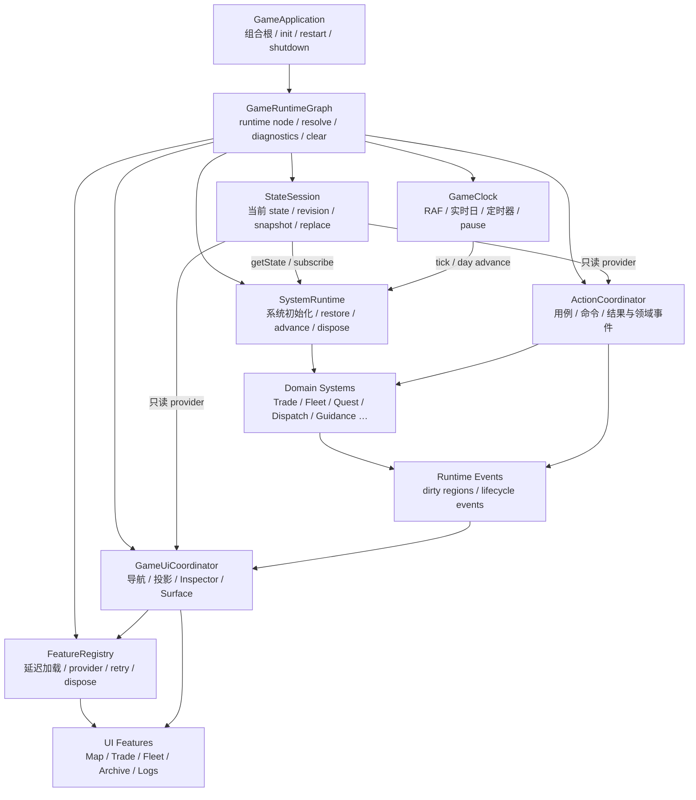
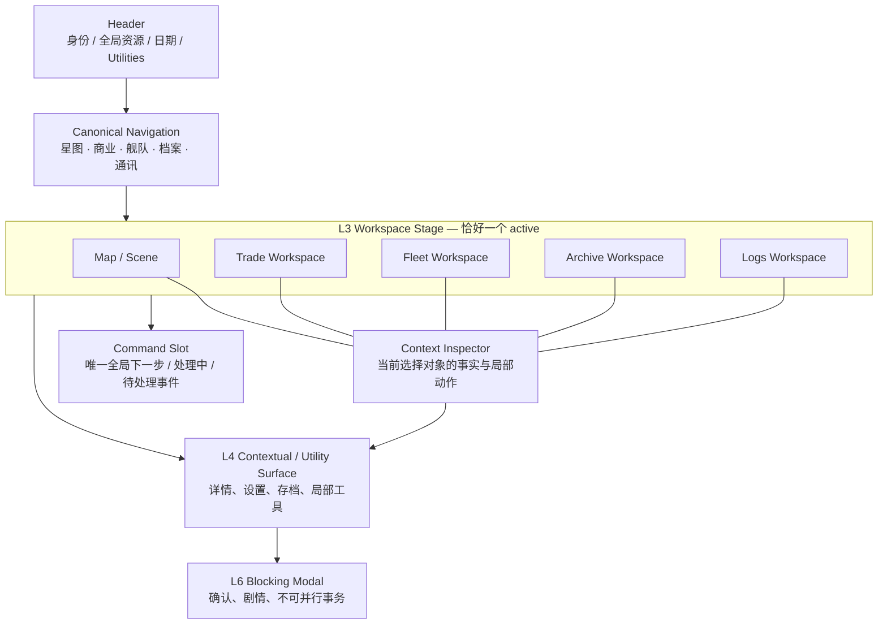

# 《星际贸易商》GameManager 与全局 UI 重构方案

> 文档状态：实施中
> 更新日期：2026-08-21
> 适用范围：`linegame-web` 浏览器单机版运行时架构、全局 UI 壳层与迁移测试
> 关联基线：[`09_技术架构设计.md`](./09_技术架构设计.md)、[`21_全局UI设计规范.md`](./21_全局UI设计规范.md)

## 0. 文档定位

本文把本轮代码审计结论转化为可分阶段验收的实施方案，解决两个已经互相放大的问题：

1. `GameManager` 同时承担组合根、状态会话、系统生命周期、时钟、动作编排、延迟加载和 UI 刷新，任何局部修改都容易影响全局。
2. 当前 UI 以“地图 + 主工作区 + 次级终端 + 多个 HUD 浮窗”叠加，导航、上下文、焦点和信息归属没有单一权威。

本文不是一次性重写计划。实施必须保持可运行、可回滚，每个阶段都先建立契约和测试，再迁移调用方。与文档 21 冲突时：

- 本文对 **L3/L4、五个一级工作区、全局壳层、Navigation、Context Inspector、Surface 与 Escape** 的定义优先。
- 文档 21 的视觉语言、Token、组件状态和可访问性要求继续有效。
- 玩法规则、存档字段和数值平衡不在本次重构范围内。

## 1. 执行结论

目标不是把重构前约 2,900 行的文件机械切成多个同样耦合的文件，而是建立八个有明确所有权的运行时对象：

- `GameApplication`：组合根和应用生命周期。
- `GameRuntimeGraph`：runtime 节点实例所有权、构造诊断与引用清理。
- `StateSession`：当前状态、替换、快照和 revision。
- `SystemRuntime`：领域系统的初始化、恢复、日推进和销毁。
- `ActionCoordinator`：用户动作和用例编排。
- `GameClock`：动画帧、实时日和计时器。
- `FeatureRegistry`：延迟功能、依赖、样式、重试和释放。
- `GameUiCoordinator`：UI 导航、投影刷新、Context Inspector、Command Slot 和 Surface 协调。

迁移结束后，`GameManager.js` 只保留 **不超过 50 行的兼容门面**；正式启动器直接依赖 `GameApplication.js`。`GameApplication` 只负责组合与顶层生命周期，Runtime Graph 状态机、101 行节点注册表与五个职责工厂簇均已独立；后续必须维持节点唯一归属和簇级体量护栏，不能把旧巨型闭包改名或重新聚合来完成验收。

## 2. 现状量化

以下数据为 2026-08-21 对当前工作树的静态盘点：

| 对象 | 现状 | 风险含义 |
| --- | ---: | --- |
| `js/core/GameManager.js` | 重构前约 2,900 行；当前 9 行 | 只重导出 `init / shutdown` 历史生命周期入口，浏览器入口与应用级测试均不再依赖它 |
| `js/core/GameApplication.js` | 当前 214 行、11 条静态 import | 已成为精简组合根，生产导出仅有 `init / shutdown`；12 个 runtime 节点经独立 `GameRuntimeGraph` 与工厂表解析，Settings/Audio/Renderer 启动职责不再由组合根实现 |
| `GameApplication` 顶层函数 | 21 个、2 个生产导出 | 应用/会话接线留在组合根；7 个应用级测试命令由 test mode 注册的冻结 harness 隔离，不再污染公共 API |
| `js/core/GameRuntimeNodeFactories.js` | 当前 101 行、6 条静态 import | 只校验组合根端口、合并职责簇并保证 12 个节点唯一归属；不再 import 领域/UI 装配依赖 |
| 五个 Runtime Factory 职责簇 | 78–163 行；每簇最多 20 条静态 import | session、feature、action、guidance、UI 分别拥有自己的节点装配；源码护栏限制单簇不超过 220 行/22 条 import |
| `js/core/GameStartupProjection.js` | 当前 117 行、4 条静态 import | 独占 Settings 读取、启动状态解析、Audio 初始化、Renderer 初始化/设置投影与 release；两阶段 API 保持 session restore 前后顺序 |
| `js/core/GameRuntimeGraph.js` | 121 行 | 已统一同步惰性构造、实例复用、循环依赖链、失败重试、generation 诊断和引用清理；不负责各 runtime 的 dispose 顺序 |
| `_handle*` / `_load*` / `_render*` / `_ensure*` 公共函数 | 0 个 | 真实 UI/剧情/随机事件端口直连 typed runtime；应用级 smoke 通过独立 `GameApplicationTestHarness` 操作同一 Runtime Graph |
| 延迟模块状态变量 | 0 个旧三元状态；15 个 manifest entry | 通用延迟生命周期已统一，领域 controller 只保留自身队列/上下文 |
| `MapUI.js` | 重构前 674 行；当前 434 行 | 星系总览、视图状态、星球/POI 投影、探索详情、面板几何/DOM、动作协议、Context/Escape、Renderer/EventBus/DOM listener 生命周期、市场入口和通用 Tab 状态机均已迁出；现只组合星图会话、视图、动作端口和注入式窄 navigation action |
| `MapExplorationPresenter.js` | 316 行 | 纯组合 POI 阻塞/完成状态、探索流程、勘探入口、秘密航线和稳定 intent；不绑定 DOM、不修改 state、不提交领域动作 |
| `MapPlanetDetailPresenter.js` | 390 行 | 纯生成星球摘要、航线焦点、路线估算、档案披露、探索组合与 travel intent；锁定目标的 travel/close 已进入 local-scope `WorkspaceActionSlot` |
| `MapPanelLayout.js` | 87 行 | 只根据容器、面板、Renderer 坐标与 Command Slot 净空生成冻结几何模型；不读取 DOM、不写样式 |
| `MapPanelController.js` | 116 行 | 独占星系、星球、POI、披露区和 Escape 的委派协议；只调用注入动作端口，MapUI 不再解析 dataset intent |
| `MapPanelViewController.js` | 213 行 | 独占星系/星球面板 DOM、ARIA、滚动保留、Renderer 锚点与命令区净空样式投影；Presenter 与纯布局不读取 DOM |
| `MapContextController.js` | 154 行 | 独占地图 Context key、Renderer selection、Context renderer 注册与地图对象 Escape layer，并保留 Inspector shell 未初始化时的兼容刷新 |
| `MapInteractionController.js` | 149 行 | 独占 Renderer 全局回调、星系视图 EventBus 订阅、面板 DOM listener 收集、绑定标记与逆序释放；回调始终经 provider 读取最新会话 state |
| `MarketWorkspaceEntryController.js` + `Session` | 236 + 93 行 | 独占商业入口按钮、打开/关闭、浏览星系/地点、一次性 focus、星系导航与刷新；Map/Market 内容会话不再交叉持有 |
| `WorkspaceTabController.js` | 235 行 | 独占 Archive/Fleet Tab listener、roving tabindex、ARIA、方向键、移动端可视提交、深链、关闭与释放 |
| `WorkspaceActionSlot.js` | 101 行 | 纯输出带 local scope、workspace/context/action id 的 L3/L4 局部操作槽；统一 Map/Market/Fleet/Archive 的 Context → L4 入口，不解释领域动作、不替代 Action Guide |
| `MapSurveyDetailPresenter.js` | 294 行 | 纯生成探索简报、异常链、报告列表/正文、复合 detail key、焦点选择器和 market/report intent；所有动态字段统一转义 |
| `MapSurveyDetailController.js` | 146 行 | 注入 latest-state/revision、系统/摘要 selector、市场端口与统一 L4 surface；独占两层 renderer 注册、动作解释、打开与释放 |
| `WorkspaceDetailSurface.js` | 380 行 | 已成为五工作区共享的 L4 非阻塞详情层，拥有不可变 detail key、renderer registry、逐层 Escape、焦点恢复和被覆盖 Context 的 inert 处理；地图探索档案是首个真实两层 adapter |
| `MapGalaxyHubPresenter.js` | 211 行 | 独占星系总览解锁/访问/贸易线索模型、HTML 和跃迁 intent；不绑定 DOM、不修改 state |
| `MapViewStateController.js` | 157 行 | 独占星系/星球视图、当前查看星系和悬停目标；所有写入经单一 controller，并始终读取最新 session state |
| `MarketUI.js` | 重构前 3,606 行；当前 337 行 | 图表、现货组合、商品、商品详情、资金、贸易站、解锁进度、价格总览、商品/图表/资金/经营交互、商品 Context/L4 状态解析、顶部 Chrome/详情模式/引导焦点、一级/二级菜单和可丢弃工作区会话已迁出；现在主要持有四个具名 render port、规范化 render context 和共享 typed command 端口注入 |
| `MarketExperienceRoute.js` | 205 行 | 无 DOM 地把公司等级、历史资产、贸易站和黑市权限投影为稳定的 workspace/subworkspace 解锁路线 |
| `MarketOverviewPresenter.js` | 145 行 | 无 DOM 地生成地点访问/研究解锁、买卖价、热度、未知报价和安全转义后的表头/行投影 |
| `MarketOverviewController.js` | 170 行 | 独占价格表 DOM、地点打开委托、买卖价按钮、键盘漫游与冻结 diagnostics；未知报价行不绑定动作 |
| `MarketGoodsController.js` | 236 行 | 独占商品工具栏、列表、快速交易、Enter/Space intent 与 typed command 转换；焦点统一提交给 Selection 端口并公开冻结 diagnostics |
| `MarketSelectionController.js` | 152 行 | 无 DOM 地统一商品焦点校验/回退、商品卡/行情榜来源、Context 去重和 `market-spot` 局部重绘请求；Session 仍是数据 owner |
| `MarketChartPresenter.js` | 398 行 | 纯生成价格序列、蜡烛/均线、公开/黑市快照、SVG 与冻结 Dashboard/K-line view model；无 DOM 或 listener |
| `MarketChartViewAdapter.js` | 161 行 | 独占六个行情 DOM 区域、Dashboard/K-line 单根 click 委托、商品行滚动同步、空 view 清理和 reset 解绑 |
| `MarketChartController.js` | 151 行 | 独占共享商品焦点、统计窗口、两视图局部重绘和冻结 diagnostics；不直接写 DOM、Context 或领域状态 |
| `MarketFinanceController.js` | 256 行 | 独占资金/贸易站稳定容器、二级菜单绑定、10 类 typed command、经营排序局部重绘、单周期 Commerce 快照和冻结 diagnostics |
| `MarketOperationsPresenter.js` | 重构前 1,170 行；当前 107 行 | 只采集领域快照、形成共享投影请求并组合本地/网络/站点三个分区与指挥台；保留四个兼容导出 |
| `MarketBatchPlanPresenter.js` | 281 行 | 独占投资/升级/策略排序、预算覆盖重算、后置清单和批量 command 系统清单投影 |
| `MarketLocalOperationsPresenter.js` | 200 行 | 独占当前地点经营状态、远程只读权限、建站/升级/增投/退出与经营方式操作投影 |
| `MarketOperationsOverviewPresenter.js` | 77 行 | 独占商网指挥台、网络指标、待处理项、批量计划组合与核心站点快照 |
| `MarketTradeStationListPresenter.js` | 201 行 | 独占候选探索情报、列表摘要、建站候选和已建贸易站卡片投影 |
| `MarketOperationsPresentationSupport.js` | 77 行 | 只提供共享安全转义、角色/策略/探索加成语义和稳定站点 DOM id |
| `MarketSpotController.js` | 235 行 | 独占公开/黑市商品快照、现货外壳、Overview/Goods/Chart/Analysis 组合、远程地点与局部重绘端口 |
| `MarketChromeController.js` | 197 行 | 独占顶部 Chrome、详情地点/市场模式、引导高亮/滚动/动作落点和安全动态 HTML；公开冻结 diagnostics |
| `MarketWorkspaceNavigation.js` | 368 行 | 独占一级/二级菜单 HTML、锁定回退、roving tabindex、ARIA、方向键和程序化焦点；只通过注入的 Session/商品聚焦端口工作 |
| `MarketCommodityDetailPresenter.js` | 111 行 | 纯生成商品 Context 摘要与 L4 详情，统一转义领域字段；买卖确认仍只属于商业工作区 |
| `MarketCommodityController.js` | 141 行 | 独占商品 Context/L4 的地点、市场模式、价格、供需、库存、现金与容器解析，公开冻结 diagnostics |
| `FleetUI.js` | 本批次前 656 行；当前 386 行 | 已移除反向全局主控依赖；公开入口使用请求对象 + 单一 typed command，机库、采购、船员、改装/保养、派遣投影与局部交互、舰船详情宿主、内联 Portal 和命令规范化均已迁出；现只组合工作区选择、Surface/确认和窄 controller 端口 |
| `FleetShipDetailPresenter.js` | 105 行 | 纯生成舰船 Context 摘要与 L4 运行详情，汇总船况、贸易循环、成本和配置；领域动作仍只属于舰队工作区 |
| `FleetShipDetailController.js` | 87 行 | 组合 Fleet/Crew selector 与纯 Presenter，独占舰船 Context/L4 宿主投影和渲染诊断；门面不再直接读取领域系统 |
| `FleetInlinePortalController.js` | 187 行 | 独占 modal box 进入/归还机库的 ARIA/inert、滚动、Escape、返回栏和焦点恢复；支持幂等程序化关闭与旧 Portal 静默归还 |
| `FleetCommandAdapter.js` | 62 行 | 独占 14 个 Fleet UI action 到规范 typed command 的转换；冻结端口并拒绝无效 payload 或缺失消费者 |
| `WorkspaceObjectDetailPresenter.js` | 100 行 | 纯生成任务、科技、派系、成就、探索报告与通讯日志的共享 L4 事实结构并统一转义；各领域 UI 保留 selector 和状态语义 |
| `FleetHangarPresenter.js` | 411 行 | 独占机库主视图只读模型、HTML 与 UI intent，不持有工作区选择状态、不绑定 DOM、不提交领域动作 |
| `FleetShopPresenter.js` | 180 行 | 独占采购评分、预算/席位信号、船卡 HTML 与购买 intent；不持有 DOM、监听器或 command 生命周期 |
| `FleetCrewPresenter.js` | 217 行 | 独占船员详情只读模型、分区 HTML 与 roster intent，不持有弹层生命周期、不绑定 DOM、不提交领域动作 |
| `FleetCrewController.js` | 293 行 | 独占船员 DOM、单一名单委托、招募/分配/撤下/切船命令、危险解雇确认、generation-safe 延迟刷新、处理器释放与冻结 diagnostics |
| `FleetModPresenter.js` | 367 行 | 独占结构升级、组件、保养与资产处置只读模型、HTML 和 UI intent；不持有 portal、焦点或危险确认生命周期 |
| `FleetModController.js` | 328 行 | 独占改装 DOM、引导焦点、五类 intent、危险售船确认、generation-safe 延迟刷新、处理器释放与冻结 diagnostics |
| `FleetDispatchPresenter.js` | 342 行 | 独占自动跑商策略验证、路线估算、风险/阻塞信号、推荐匹配与 CTA 投影；不持有 DOM、portal 或提交生命周期 |
| `FleetDispatchSession.js` | 103 行 | 独占自动跑商草案、打开/关闭原因、估算/提交/reset 计数和冻结 diagnostics；不持有 DOM 或领域系统 |
| `FleetDispatchViewAdapter.js` | 341 行 | 独占 21 个派遣表单节点、选项/校验/摘要/CTA 投影、11 类处理器绑定与释放 |
| `FleetDispatchController.js` | 415 行 | 只编排可访问地点、路线推荐/估算、确认/取消、Surface 适配与命令提交；不查询或写入 DOM |
| `QuestUI.js` | 重构前 1,279 行；当前 98 行 | 只保留 Session/Presenter/Controller、Context/L4 adapter 与兼容导出的组合，不再查询任务子节点、生成任务大段 HTML 或持有确认生命周期 |
| `QuestWorkspaceSession.js` | 38 行 | 独占任务候选焦点和选择/reset 诊断；不缓存任务或 state 快照 |
| `QuestPresentationSupport.js` | 14 行 | 只提供任务生命周期投影共享 HTML/属性转义 |
| `QuestAvailablePresenter.js` | 177 行 | 独占可接任务优先级、稳定候选回退、接取简报、奖励与候选列表冻结投影 |
| `QuestActivePresenter.js` | 111 行 | 独占进行中任务进度、路线/派遣、奖励、披露详情与放弃 intent 冻结投影 |
| `QuestLockedPresenter.js` | 47 行 | 独占未解锁任务、锁因、奖励与章节完成空态冻结投影 |
| `QuestBoardPresenter.js` | 208 行 | 只组合章节指挥台、详细分诊和三个生命周期子投影；不再持有任务卡实现 |
| `QuestRoutePresenter.js` | 320 行 | 纯生成目标系统、路线预览、派遣建议、阻塞信号及恢复动作，并统一转义动态字段 |
| `QuestObjectivePresenter.js` | 79 行 | 纯生成任务目标文案和单位/数量计划 |
| `QuestDetailPresenter.js` | 124 行 | 纯生成任务 Context 摘要和共享 L4 详情事实视图 |
| `QuestBoardController.js` | 235 行 | 独占任务根节点 click/keydown 委托、选择/检查/接取/派遣/阻塞恢复、危险放弃确认、generation-safe 旧确认丢弃和处理器释放 |
| `ResearchUI.js` | 重构前 716 行；当前 96 行 | 只保留 Board/Dispatch/Detail Presenter、Controller、Context/L4 adapter 与兼容导出的组合，不再查询科研子节点、逐卡绑定 listener 或依赖领域 selector |
| `ResearchBoardPresenter.js` | 196 行 | 纯生成科研总览、候选、队列、当前与完成状态，输出稳定 data intent 并统一转义动态字段 |
| `ResearchDispatchPresenter.js` | 168 行 | 纯选择并投影科研补给建议、阻塞状态和恢复动作；不读取 DOM、不提交领域动作 |
| `ResearchDetailPresenter.js` | 105 行 | 纯生成科技 Context 摘要和共享 L4 详情事实视图 |
| `ResearchBoardController.js` | 238 行 | 独占候选/队列与已完成两个稳定交互根、研究/队列/派遣/检查委托、generation-safe 清空确认、解绑和冻结 diagnostics |
| `FactionUI.js` | 重构前 446 行；当前 65 行 | 只保留 Board/Detail Presenter、Controller、Context/L4 adapter 与兼容导出的组合，不再查询派系子节点、逐卡绑定 listener 或依赖领域 selector |
| `FactionBoardPresenter.js` | 179 行 | 纯生成派系关系总览、重点信号、派系卡、安全市场 CTA 与稳定 data intent |
| `FactionDetailPresenter.js` | 117 行 | 纯生成派系 Context 摘要和共享 L4 详情事实视图 |
| `FactionBoardController.js` | 125 行 | 独占单一派系列表根、卡片检查/键盘/市场跳转委托、Context 同步、解绑和冻结 diagnostics |
| `AchievementUI.js` | 重构前 318 行；当前 63 行 | 只保留 Board/Detail Presenter、Controller 与 Context/L4 adapter 组合，不再查询成就子节点、逐卡绑定 listener 或依赖领域 selector |
| `AchievementBoardPresenter.js` | 121 行 | 纯生成成就总览、分类分布、完成焦点、奖励池、卡片与稳定 data intent |
| `AchievementDetailPresenter.js` | 100 行 | 纯生成成就 Context 摘要和共享 L4 详情事实视图 |
| `AchievementBoardController.js` | 74 行 | 独占单一成就列表根、卡片检查/键盘委托、解绑和冻结 diagnostics |
| `ArchiveExplorationUI.js` | 重构前 360 行；当前 81 行 | 只保留 Session、Board/Report Detail Presenter、Controller、Context/L4 adapter 与兼容导出的组合，不再查询探索子节点、逐卡绑定 listener 或依赖领域 selector |
| `ArchiveExplorationSession.js` | 47 行 | 独占航点/连续任务焦点和 set/reset 诊断；不缓存报告或 state 快照 |
| `ArchiveExplorationPresenter.js` | 136 行 | 纯生成探索总览、航点进度、报告卡、连续任务与安全焦点标记 |
| `ArchiveReportDetailPresenter.js` | 96 行 | 纯生成报告查找、信号标签、Context 摘要和共享 L4 详情事实视图 |
| `ArchiveExplorationController.js` | 113 行 | 独占单一探索档案根、报告检查/键盘委托、航点/连续任务聚焦滚动、解绑和冻结 diagnostics |
| `SettingsManager.js` | 重构前 416 行；当前 36 行 | 只保留 Modal Controller、Core 读写兼容导出与 diagnostics 组合，不再查询 DOM、发布设置命令细节或绑定 launcher |
| `SettingsViewPresenter.js` | 55 行 | 纯生成规范化设置控件、可读摘要与分页标题冻结模型 |
| `SettingsModalController.js` | 324 行 | 独占设置弹层内部控件、分页键盘、命令反馈、危险确认、Blocking Surface 与完整释放 |
| `SaveCommand.js` | 26 行 | 规范化并冻结保存/读取槽位 command，拒绝未知、非数字类型、空白、负数和非整数槽位 |
| `SaveCommandAdapter.js` | 20 行 | 独占 Save UI 保存/读取 intent 到单一 typed command 的转换；删除和文件迁移仍留在工作区本地 effect |
| `SaveUI.js` | 重构前 447 行；当前 18 行 | 只保留 Workspace Controller 请求对象 render、diagnostics 与 reset 组合，不再查询 DOM、访问 SaveSystem、实现文件迁移或接收位置参数回调 |
| `SaveWorkspacePresenter.js` | 205 行 | 纯生成存档安全状态、槽位、迁移区、初始反馈与危险确认描述，统一转义存档来源文本 |
| `SaveWorkspaceController.js` | 307 行 | 独占单一存档根事件委托、保存/读取/删除确认、typed command 发布、导入导出、FileReader 失效保护、临时资源释放与 diagnostics |
| `TutorialUI.js` | 重构前 438 行；当前 25 行 | 只保留 Overlay Controller 的 `init/show/hide/destroy/getDiagnostics` 兼容组合，不再读取 DOM、订阅 EventBus 或依赖 TutorialSystem |
| `TutorialStepPresenter.js` | 65 行 | 纯生成教程步骤内容、进度、辅助动作与可访问语义，统一安全转义 |
| `TutorialTooltipLayout.js` | 229 行 | 独占 visual viewport、安全区、四向翻转、逐帧重排与 resize/scroll listener 生命周期 |
| `TutorialOverlayController.js` | 234 行 | 独占 EventBus 重入订阅、步骤交互、高亮、焦点恢复、show/hide/destroy 与 diagnostics |
| `DialogueUI.js` | 重构前 384 行；当前 29 行 | 只保留 Modal Controller 的 `init/showScene/hideScene/isOpen/destroy/getDiagnostics` 兼容组合，不再读取 DOM 或持有播放状态 |
| `DialogueSession.js` | 109 行 | 独占主线/回应播放、分支选择、已选结果和 reset 诊断，不持有 DOM 或完成回调 |
| `DialoguePresenter.js` | 81 行 | 纯生成场景、说话者、进度、摘要、分支卡、选项与按钮冻结模型 |
| `DialogueModalController.js` | 340 行 | 独占剧情 Blocking Surface、稳定 DOM、键盘、选择防重、焦点、完成提交和完整释放 |
| `ContextInspector.js` | 重构前 490 行；当前 35 行 | 只保留 Session/Presenter/Controller 的兼容组合与原公开 API 委托，不再查询 DOM、持有 renderer 或维护工作区会话 |
| `ContextInspectorSession.js` | 179 行 | 独占五工作区不可变 context key、常规/紧凑视口独立开合偏好、compact 策略与 revision 校验；不读取 DOM 或缓存领域对象 |
| `ContextInspectorPresenter.js` | 26 行 | 纯生成 Inspector 壳层标题、context 标识、renderer 结果与统一空态冻结模型 |
| `ContextInspectorController.js` | 426 行 | 独占 Inspector DOM、renderer/action 注册、latest-state 读取、Escape layer、视口模式开合协调、焦点恢复和完整释放；同时投影 `empty/context` 内容态供响应式几何使用 |
| `GameUiCoordinator.js` | 重构前 680 行；当前 377 行 | 只保留 dirty-region 路由、Feature load/ensure/reset、全局非工作区刷新与 diagnostics 组合；不再构造四个工作区区域请求或持有渲染计数状态 |
| `GameUiWorkspaceRenderer.js` | 309 行 | 独占 Market/Fleet/Archive/Save 区域请求、局部 renderer 回退、Context adapter 连接与 typed command 注入；四个 Feature 均只向 UI 发布请求对象和单一 command 端口，始终经 provider 读取最新 state |
| `GameUiRenderSession.js` | 87 行 | 无 DOM/state 地记录成功区域、嵌套刷新事务、全量/失效次数与 reset 后冻结 diagnostics |
| `GameUiApplicationRuntime.js` | 重构前 433 行；当前 410 行 | 只保留 MarketWorkspace、Settings、Coordinator、Lifecycle 与 Context adapters 的惰性组装，以及 ensure/render/invalidate/reset/dispose 顶层生命周期；不再内联 navigation 与复合 diagnostics |
| `GameUiNavigationPort.js` | 49 行 | 独占领域、命令与引导共享的冻结惰性导航 API；每次调用读取最新 owner，缺失端口安全降级 |
| `GameUiApplicationDiagnostics.js` | 30 行 | 纯组合 Coordinator renderer/session、Feature recovery 与子控制器 diagnostics；缺失惰性 controller 时返回稳定可序列化空快照 |
| `GameShellProjection.js` | 70 行 | 全局 Shell 的单一刷新事务；组合 Header、公司经营、Archive 角标与长期路线摘要，公开冻结 diagnostics，不持有 state 快照 |
| `HUD.js` | 125 行 | 固定 dashboard、Header/公司/Archive Badge 投影、胜利/舰队/任务 mutation、任务动作死端口与长期路线 presenter 已移出；当前只保留交互生命周期和通讯日志门面 |
| `HeaderStatusPresenter.js` | 201 行 | 纯投影 Header 信用点、位置、日期、当前舰船、声望、资源 meter 与星图工具状态，不绑定 listener、不修改领域状态 |
| `CompanyOverviewPresenter.js` | 141 行 | 纯投影 Header 公司身份和机库净资产、玩家/公司等级、容量与开放权限；不再把声望/日期/信用点镜像进工作区 |
| `ArchiveBadgePresenter.js` | 65 行 | 从任务、探索、科研、派系与成就 selector 构造冻结角标快照，只投影五个 Archive Tab 与一个主导航 badge |
| `HudInteractionController.js` | 273 行 | 独占日志事件、胜利弹层、星图工具、Context 初始化、`900px` 断点 listener 与完整 dispose/re-init；长期路线选择只调用注入 typed action |
| `VictoryProgressPresenter.js` | 147 行 | 纯渲染长期路线摘要与详情，统一领域内容转义、缺口排序与进度可读语义 |
| `SurfaceManager.js` | 336 行 | 只拥有 Blocking Surface、焦点陷阱、状态观察与唯一 Escape dispatcher；不再认识任何 L3 workspace DOM |
| `WorkspaceSurfaceController.js` | 196 行 | 五个同级 canonical L3 共用 `is-active`、`data-workspace-active`、`inert`、ARIA、来源相关焦点与诊断协议；程序化进入使用 generation-safe 延迟焦点提交 |
| 全部 CSS | 28,871 行 | 级联和其他功能的重复响应式规则仍需继续收敛；Header、Bottom Nav、Action Guide、Starmap Controls 与 Market 延迟基础样式均已形成明确 owner，legacy 中 162 个 Header、97 个 Bottom Nav 规则/混合选择器、423 行 Action Guide/Command Slot、1,425 行旧星图控制轨/HUD 小窗、724 行退役 Company Directives UI 及 566 行旧市场面板/重复规则已物理清除；Context Inspector 与 Workspace Detail 已拆成独立文件，`global-shell-v2.css` 从 789 行降至 72 行；窄屏 L3 Header 与空态 Inspector 几何已加入静态回归保护 |
| `interstellar-trader.css` | 7,272 行 | 仍是主要遗留级联源，但已完全移除 Header、Bottom Nav、旧星图控制轨、隐藏 3D 按钮、五个并行 HUD 小窗、Company Directives UI 与全部 Market Feature 私有选择器；混合规则保留其他有效组件选择器，且不再包含 exploration-terminal/current-system-card/company-name-btn 无 DOM 命中规则 |
| `market-terminal.css` / `fleet.css` | 7,139 / 2,135 行 | 3,193 行 Market 基础规则已从错误的 Fleet 延迟 owner 迁入市场 Feature，另有 497 个有效选择器分支从全局 `panels/systems/responsive/interstellar-trader` 级联迁入；这五个旧 owner 不再声明任何 Market/Trade/Kline/BM 选择器，市场首次打开无需依赖机库加载历史，主包也不再预载 Feature 私有视觉 |
| `modals.css` | 433 行 | 只保留仍有运行时消费者的 Blocking Modal 基础与事件/确认类组件；已删除 373 行无入口、无 Presenter 的 Company Directives modal 规则 |

行数不是单独的缺陷；真正问题是这些文件之间不存在稳定的所有权边界。当前一次“载入存档”同时涉及状态指针、系统重初始化、延迟模块同步、教程生命周期和全量 UI 刷新，测试只能通过大量集成桩或源码字符串断言保护行为。

## 3. 已确认的真实缺陷与结构风险

### 3.1 状态替换后存在陈旧引用

`UIManager` 曾在初始化时持有 `_state` 对象。手动读档会替换 `GameManager._state`，但 UI 仍可能读取旧对象。首批修复已把接线改为 `UIManager.init(() => _state, ...)`，证明状态快照不能由长期存活的 UI 模块缓存。

这不是只修一个参数即可永久解决的问题。所有长生命周期对象都必须通过 `StateSession.getState()` 或只读 provider 获取当前状态；异步加载完成后也必须重新读取，而不能使用发起加载时捕获的对象。

### 3.2 冷启动与手动读档生命周期不一致

冷启动路径会初始化教程、平衡指标和中期教学链，手动读档路径曾遗漏这些步骤，导致同一存档通过不同入口进入后产生不同运行时状态。首批修复已在读档成功后补齐：

- `Tutorial.init(_state)`
- `BalanceMetrics.init(_state)`
- `MidgameTeachingChain.init(_state)`

长期方案必须由 `SystemRuntime.restore(session)` 统一顺序，禁止各入口自行复制初始化清单。

### 3.3 延迟功能重复维护状态机

市场、舰队、档案、存档以及胜利、剧情、随机事件、设置、引导等功能分别维护 `module/promise/error/initialized`。重复代码会产生三类差异：并发加载是否合并、失败后能否重试、状态替换后是否重新初始化。

`FeatureRegistry` 已由首批 loader 演进为 manifest 状态机；`GameFeatureManifest` 唯一声明市场、舰队、档案、存档、胜利、设置、教程、引导、经营/路线/成就、剧情与随机事件的动态 import、依赖、延迟 CSS、同步 hooks 和失败语义；`GameFeatureRuntime` 再把两者组合成稳定端口。`GameManager` 不再复制 configured 标志、按功能命名的加载包装、module/promise/error 状态或资源表。

### 3.4 导航存在多重所有者

底部导航、地图返回和终端开关分散在 `UIManager`、`MapUI`、功能 UI 与 `SurfaceManager`。现有测试甚至需要专门防止一次点击触发两次切换。这说明“谁决定当前工作区”尚未成为单一事实源。

目标状态中只有 `NavigationController` 可以改变 canonical workspace；旧 DOM 点击处理器只作为适配器调用它。

### 3.5 全量刷新掩盖依赖关系

`_updateUI()` 同时更新 HUD、飞船、地图、已加载终端、派遣和行动引导。它无法表达“动作只使哪些投影失效”，也容易在未加载模块与状态替换之间产生时序错误。

`renderAll()` 只保留给会话进入和 Feature 首次同步等非动作生命周期，并必须通过 `UI_REGION.ALL` 显式请求。所有新动作必须返回明确的 `dirtyRegions` 或领域事件；缺失、空白或非法 presentation 统一经 `resolveDirtyRegions()` 降级到 `DEFAULT_ACTION_DIRTY_REGIONS`，任何生产 controller 都不得再调用无参数 `invalidate()` / `updateUI()` 或退回全量刷新。Command Slot 的导航焦点使用独立最小矩阵，只触达目标 presenter、Context 与 Guide，不能借用领域动作矩阵制造无关重绘。

### 3.6 UI 层级与产品信息架构冲突

当前把市场称为 Primary Workspace，把机库、档案和日志称为 Secondary Terminal，但它们实际都是一级目的地。产品语义上的不平等迫使实现使用两套互斥和返回逻辑，也让 Escape、焦点恢复和移动端布局不一致。

地图内又并列银河地图、市场概览、当前航点、贸易网络、任务跟踪和星球详情，多个区域竞争“当前上下文”；Header、终端摘要和行动引导还会重复显示同一状态。

### 3.7 Surface 可访问性契约尚不完整

现有 `SurfaceManager` 已具备部分焦点保存、阻塞弹窗 Tab 陷阱和 Escape 关闭能力，但背景 `inert`、跨层级的唯一 Escape 调度、非活动工作区的可聚焦元素隔离仍需统一。功能模块各自监听 `document.keydown` 会造成一次 Escape 关闭多层，或在关闭弹窗后意外跳回地图。

### 3.8 CSS 有分层意图，但尚未形成所有权

项目已有 Token → Primitive → Surface → Responsive 的入口顺序，但 12,794 行遗留主样式和多个大型功能样式仍包含全局选择器、重复 media query 和局部 z-index。只调整加载顺序不能解决级联所有权问题。

## 4. 目标职责架构



箭头表示依赖或调用方向。领域系统不 import UI；Feature 不持有状态快照；`GameApplication` 只组装这些对象，不实现领域规则。

### 4.1 `GameApplication`

唯一职责：

- 声明并注入应用运行时节点及其端口连接。
- 暴露 `init`、`newGame`、`loadGame`、`restart`、`shutdown` 等应用生命周期。
- 处理顶层错误边界和启动诊断。
- 在迁移期维护旧 `GameManager` 导出 API 的兼容门面。

禁止：直接查询 DOM、计算价格、修改任务状态、渲染工作区、维护每个功能的 Promise。

#### 4.1.1 `GameRuntimeGraph`

唯一职责：

- 按稳定 node id 惰性创建并复用同步 runtime 实例。
- 在构造期检测循环依赖并返回完整节点链。
- 保留失败、重试、创建次数和 generation 诊断。
- 在 `GameApplicationLifecycle` 完成有序 dispose 后统一释放节点引用。

禁止：决定节点 dispose 顺序、执行领域规则、持有 DOM 或接受异步工厂。节点定义和依赖注入仍属于 `GameApplication`，Graph 只拥有实例生命周期状态。

### 4.2 `StateSession`

唯一职责：

- 持有当前 state 指针与单调递增的 `revision`。
- 创建新局、替换读档状态、提供序列化快照。
- 提供 `getState()`、`getRevision()`、`replace()`、`subscribe()`。
- 在替换前后发布 `session:replacing` / `session:replaced`。

约束：订阅者可以保存 revision，不可以永久保存可变 state 引用；异步回调执行前必须比对 revision 或重新获取 state。

### 4.3 `SystemRuntime`

唯一职责：

- 按声明顺序执行领域系统的 `initialize`、`restore`、`capture`、`advanceDay`、`dispose`。
- 把冷启动、重新开始和手动读档收敛到同一个生命周期表。
- 隔离有运行时缓存的系统与纯函数系统。
- 保证同一 session revision 只初始化一次。

系统清单必须是数据，而不是分散在多个处理函数中的调用序列。

### 4.4 `ActionCoordinator`

唯一职责：

- 接收 UI 意图，例如 `trade.buy`、`travel.start`、`quest.accept`。
- 校验前置条件并调用一个或多个领域系统。
- 返回统一结果：`{ ok, code, message, events, dirtyRegions, focusTarget }`。
- 将跨系统事务的补偿或失败边界集中处理。

禁止：显示弹窗、查找 DOM、直接切换工作区。需要 UI 反馈时返回语义结果，由 UI 层解释。

### 4.5 `GameClock`

唯一职责：

- 管理 RAF、实时日期推进、派遣计时和暂停状态。
- 提供 `start`、`pause`、`resume`、`reset`、`dispose`。
- 接收可注入的 `now`、`requestFrame` 和 scheduler，支持假时钟测试。
- 重启、读档和页面隐藏时不得遗留旧计时器。

### 4.6 `FeatureRegistry`

唯一职责：

- 以 manifest 声明功能的 JS、CSS、依赖和生命周期。
- 合并并发加载，记录 `idle/loading/ready/error/disposed`。
- 失败后可重试；初始化失败不能标记为 ready。
- 在 session 替换时调用 `sync`，在应用关闭时 `dispose`。
- 提供诊断快照，不依赖散落的 `body.dataset` 作为事实源。

`FeatureRegistry` 是唯一通用延迟加载 owner，禁止为新功能重新增加独立的 module/promise/error 三元组。

`GameFeatureRuntime` 是游戏组合层唯一可用的已配置端口：它在创建时注册 manifest，提供 `loadOrReject` 失败契约，并代理 load/sync/dispose/diagnostics。业务调用方不得再持有“是否已配置”标志或按功能复制加载包装函数。

### 4.7 `GameUiCoordinator`

唯一职责：

- 连接 Navigation、Context Inspector、Command Slot 和 Surface stack。
- 从 `StateSession` provider 获取最新状态，生成 UI 投影。
- 按 `dirtyRegions` 更新；迁移期提供 `renderAll()`。
- 将具名内部区域路由给 `GameUiWorkspaceRenderer`；内部区域仅在对应 L3 活动时重绘，显式整体区域覆盖并去重。
- 在用户首次进入工作区时向 `FeatureRegistry` 请求功能。
- 从 `GameUiRenderSession` 组合成功渲染计数、最近事务与失效 diagnostics。

禁止：实现交易或任务规则；直接 import 所有延迟 Feature；保存长期 state 快照。

`GameUiWorkspaceRenderer` 是 Market/Fleet/Archive/Save 请求构造、局部 renderer 选择、Context adapter 连接与 typed command 注入的唯一 owner；`GameUiRenderSession` 是成功区域计数和刷新事务的唯一 owner。二者不解释 dirty region，也不加载 Feature。

## 5. GameManager A–F 拆分计划

每阶段都必须能单独合入、回滚并保持主流程可玩。只有完成本阶段验收后才能删除旧路径。

### A. 契约冻结与可观测基线

实施内容：

- 为启动、新局、重开、自动存档、手动存档和手动读档建立生命周期矩阵。
- 固化动作结果、runtime 事件、dirty region 与 Feature manifest 的 JSDoc 契约。
- 记录当前 listener、timer、动态 import 和 Surface 数量，增加开发环境诊断快照。
- 保留现有 UI 和 DOM，不做视觉改版。

验收：

- 六条生命周期路径均有集成测试。
- 同一操作的系统初始化顺序可被断言。
- 重复 `init/restart/load` 不增加 listener 或 timer。
- 当前用户可见行为与阶段开始前一致。

### B. 提取 `StateSession` 与 `FeatureRegistry`

实施内容：

- 以 `StateSession` 替代全局 `_state` 的跨模块传播。
- ~~将首批 loader 扩展为 manifest 驱动的 `FeatureRegistry`。~~ ✅ 已完成；后续只允许增加 manifest entry，不再增加旁路状态机。
- 先迁移市场、舰队、档案、存档，再迁移胜利、剧情、随机事件、设置、教程、引导、商业运行时和成就。
- 所有 Feature 初始化接收 provider 或 session context。

验收：

- 读档替换后，已加载和加载中的 Feature 都读取新状态。
- 并发加载只执行一次；失败可重试；dispose 后可重新加载。
- `GameManager` 不再存在按功能复制的 module/promise/error 三元组。
- 初始 bundle 不意外包含延迟 Feature。

### C. 提取 `SystemRuntime` 与 `GameClock`

实施内容：

- 把冷启动、重新开始和读档后的系统初始化收敛到 runtime manifest。
- 把 RAF、实时日、派遣时钟与暂停逻辑迁入 `GameClock`。
- 为有缓存的系统实现 restore/capture/dispose。

验收：

- 冷启动与手动读档执行同一份系统清单。
- Tutorial、BalanceMetrics 和 MidgameTeachingChain 不再由入口函数单独补调用。
- 使用假时钟可确定性验证跨日、暂停与恢复。
- 连续重开、连续读档后只有一个有效 clock。

### D. 提取 `ActionCoordinator`

实施内容：

- 按 `trade`、`travel`、`fleet`、`quest`、`research`、`dispatch`、`guidance` 分组迁移 `_handle*`。
- 把确认、失败原因、事件和刷新区域编码到统一动作结果。
- 将 UI 需要的动作端口集中注入，不再传递超长位置参数链。

验收：

- `GameManager` 不直接改变领域字段。
- 每组动作有纯单元测试和至少一条跨系统集成测试。
- 失败动作不产生部分写入；成功动作声明准确的 dirty region。
- UI 可以使用同一结果模型显示 toast、阻塞确认和焦点目标。

### E. 提取 `GameUiCoordinator` 并迁移新 IA

实施内容：

- 接线唯一 NavigationController、ContextInspectorController 和 Surface stack。
- 建立 Header、Workspace Stage、Context Inspector、Command Slot 和五个 canonical workspaces。
- 逐一把旧市场、机库、档案、日志 DOM 接到工作区适配器。
- 将 `_updateUI()` 改为 coordinator 的兼容入口，再迁移到增量刷新。

验收：

- 任意时刻恰好一个 canonical workspace active。
- 重复点击当前导航项为幂等操作，不折叠、不隐式返回地图。
- 非活动工作区不可见、不可聚焦且 inert。
- Focus、Escape、阻塞弹窗与详情层符合第 9 节契约。
- 桌面和移动端都不再使用 Primary/Secondary 两套一级导航语义。

### F. 收口组合根与清理兼容层

实施内容：

- `GameApplication` 成为真实组合根，`GameManager` 仅保留公共门面。
- 删除重复绑定、旧 Feature 状态机、旧导航 fallback 和无调用的兼容选择器。
- 完成 CSS 分层迁移和五视口浏览器验收。
- 补充架构依赖检查，禁止领域层 import UI。

验收：

- `GameManager.js` 不超过 **50 行**且只重导出兼容 API；`main.js` 直接依赖 `GameApplication.js`。
- Runtime Graph、启动投影和应用生命周期各有明确 owner，`GameApplication` 不实现领域规则。
- 文件中无领域状态写入、无工作区渲染、无直接 DOM 查询、无独立 timer。
- 全量单元/集成测试、生产构建和五视口 QA 通过。
- 没有未登记的 document 级事件监听器或 z-index。

## 6. 新全局信息架构



### 6.1 壳层构成

1. **Header**：只展示跨工作区仍然成立的身份和关键资源；设置、存档、胜利进度作为 utility 入口，不成为一级工作区。
2. **Map / Workspace Stage**：地图是五个工作区之一，也是默认工作区；其它工作区在同一 stage 中替换它，而不是作为不同等级的弹层盖住它。
3. **Context Inspector**：唯一的“当前选中对象”区域。地图中的星球、航线，商业中的商品，舰队中的飞船，档案中的任务都使用同一上下文协议。
4. **Command Slot**：唯一全局“下一步”与进行中行动区域。事件通知、教学建议和动作处理状态必须在这里仲裁，不再各占一个浮窗。
5. **Canonical Navigation**：五个平级目的地，任意时刻恰好一个 active。

### 6.2 五个 canonical workspaces

为兼容已落地的 `NavigationController` 骨架，canonical code id 定为：

| code id | 用户术语 | 旧入口别名 | 唯一职责 |
| --- | --- | --- | --- |
| `map` | 星图 | `starmap` | 位置、航线、星球选择、旅行目标 |
| `trade` | 商业 | `market` | 价格、买卖、订单、金融和站点商业 |
| `fleet` | 舰队 | `hangar` | 舰船、船员、改装、维护和派遣 |
| `archive` | 档案 | `quests` | 任务、探索、研究、派系和成就 |
| `logs` | 通讯 | `console` | 日志、剧情对话、消息和历史通知 |

旧别名只允许在 DOM/存档书签等适配边界归一化；核心状态、测试和新代码必须使用 canonical id。`settings`、`save`、`victory` 不是 workspace。

## 7. L3 / L4 重定义

文档 21 中“L3 Primary Workspace / L4 Secondary Terminal”的产品等级在本方案中废止，替换为：

| 层级 | 新名称 | 内容 | 互斥与生命周期 |
| --- | --- | --- | --- |
| L0 | Scene | WebGL/2D 世界背景 | 随工作区策略保持或暂停 |
| L1 | Global Shell | Header、canonical nav | 常驻；阻塞弹窗时 inert |
| L2 | Context & Command | Context Inspector、Command Slot、非阻塞状态 | 随 active workspace 更新 |
| **L3** | **Canonical Workspace** | `map/trade/fleet/archive/logs` | 恰好一个 active；平级切换 |
| **L4** | **Contextual / Utility Surface** | 对象详情、局部 drawer/sheet、设置、存档等工具 | 位于当前 L3 之上；按 stack 管理；不是一级导航 |
| L5 | Non-blocking Feedback | Toast、短暂事件反馈 | 不夺焦点、不覆盖主操作 |
| L6 | Blocking Modal | 交易确认、剧情决策、破坏性确认 | 同时一个；锁定焦点和背景 |
| L7 | Guided Overlay | 强制教学聚焦 | 最高交互优先级，显式开始/结束 |

`#market-overlay`、`#trade-panel`、`#info-panel`、`#console-panel` 等历史 ID 仅保留为 Feature/测试定位点；五个 L3 已是 `#game-main` 的同级 `.workspace-surface`，统一由 `is-active + data-workspace-active + inert/aria-hidden` 投影。不得再根据“primary/secondary”、drawer 方向或 DOM 嵌套给工作区设置不同关闭规则。

## 8. 信息唯一归属与术语

### 8.1 信息所有权

| 信息 | 权威位置 | 允许的摘要 | 禁止重复 |
| --- | --- | --- | --- |
| 公司名、信用点、日期、关键舰船资源 | Header | 阻塞交易内可显示交易后余额 | 各工作区重复完整全局 HUD |
| 当前星球、航线、商品、飞船、任务的详情 | Context Inspector | 列表行可显示识别所需摘要 | 多个地图浮窗同时声明“当前” |
| 全局下一步、待确认事件、动作处理中/完成 | Command Slot | 控件就地 loading/error | Header、任务卡和 toast 同时给下一步 |
| 位置、航行目标、星系关系 | Map | Inspector 显示当前选择 | 商业工作区复制完整地图状态 |
| 价格、库存、订单、金融 | Trade | Header 仅保留信用点 | Map 的常驻市场概览复制全表 |
| 舰船、船员、改装、维护、派遣 | Fleet | Header 仅显示当前舰关键告警 | Archive 重复舰队管理动作 |
| 任务、研究、探索、派系、成就 | Archive | Command Slot 可引用一个当前目标 | 多个常驻任务跟踪器竞争焦点 |
| 日志、对话、消息历史 | Logs | Toast 只显示短暂摘要 | 日志内容在多个终端永久复制 |

同一数据在第二位置出现时，必须回答“这个摘要支持什么当前决策”。没有答案就删除摘要。

### 8.2 术语表

- **工作区 / Workspace**：只指 L3 五个一级目的地。
- **星图、商业、舰队、档案、通讯**：面向玩家的固定名称，不混用“市场页/交易终端”“机库页”“任务页/信息面板”“控制台/日志页”。
- **Context Inspector / 上下文检查器**：当前选择对象的事实与局部动作，不称“HUD 卡片”或“详情弹窗”。
- **Command Slot / 行动槽**：唯一全局下一步、处理中和待处理事件位置，不再同时使用“行动建议”“任务提示”“下一目标”等全局术语。
- **Surface**：内部交互容器契约，不作为玩家可见标题。
- **Modal / 模态框**：仅指 L6 阻塞流程；非阻塞详情不能称为 modal。
- **Terminal / 终端**：可以保留为视觉叙事词，但不表达导航层级。

## 9. 交互与可访问性契约

### 9.1 Navigation 契约

最小状态：

```js
{
  workspaceId: 'map' | 'trade' | 'fleet' | 'archive' | 'logs',
  detailStack: Array<ContextKey>,
  revision: number
}
```

规则：

1. 只有 NavigationController 能改变 `workspaceId`。
2. `navigate(id, metadata)` 对非法 id 和当前 id 必须是无副作用 no-op。
3. 工作区切换顺序固定为 `beforeLeave → state commit → afterEnter → publish → focus`。
4. 每次有效切换读取最新 `StateSession`，不携带旧 state 快照。
5. 点击当前导航项不得关闭工作区或跳回地图；地图必须通过显式 `map` 导航进入。
6. 旧别名仅在 adapter 调用 `normalizeWorkspace` 时接受。
7. 工作区加载失败时仍保留导航状态，stage 显示可重试错误，不偷偷回退到另一个工作区。

### 9.2 Context Inspector 契约

上下文使用可辨识记录：

```js
{
  type: 'planet' | 'route' | 'commodity' | 'ship' | 'quest' | 'message',
  id: string,
  workspaceId: string,
  source: string,
  revision: number
}
```

规则：

- Inspector 只保存 context key，不保存领域对象副本；渲染时从最新 state 投影。
- `replaceContext` 是幂等操作，`clearContext` 只清当前工作区上下文。
- 每个工作区可保留自己的 detail stack，切回时恢复选择；读档后无法解析的 key 自动清理。
- `ContextInspectorSession` 是 context key、开合偏好与 revision 的唯一事实源；`ContextInspectorPresenter` 不得读取 DOM，`ContextInspectorController` 不得缓存领域对象。
- renderer/action 每次执行前都读取 latest-state provider；关闭后的焦点恢复和 Escape 注册只由 Controller 持有，兼容门面不得建立第二套 listener。
- 桌面默认 dock，窄屏默认 bottom sheet；两者使用同一状态和动作集合。
- Inspector 展示事实、比较和局部动作，不承载全局下一步或完整工作区列表。

### 9.3 Surface 契约

所有 L4–L7 容器必须注册：

```js
{
  id,
  layer,
  kind,
  dismissible,
  ownerWorkspace,
  triggerElement,
  initialFocus,
  returnFocus
}
```

规则：

- `open`、`close` 必须幂等；显示状态只能由 Surface manager 修改。
- 功能模块不得直接切换通用 `.active/.hidden` 来绕过 stack。
- manager 提供可测试快照：active workspace、stack、blocking surface、focus owner。
- 关闭拥有子层的 Surface 时必须先从顶层向下关闭。
- L4 是上下文/工具层，不得改变 canonical workspace 的 active 状态。

### 9.4 Focus 契约

- 底栏直接切换后焦点保留在选中 nav；行动/深链/程序化切换则在 Feature 就绪后进入工作区标题、选中 tab 或声明的主要输入。两种路径都不得落到 `body`。
- 打开 L4 时焦点进入其标题或首要控件；非阻塞 L4 不默认设置全局 Tab trap。
- 打开 L6/L7 时锁定焦点；Tab 与 Shift+Tab 在有效可见控件间循环。
- 关闭后优先恢复触发元素；触发元素已不存在时依次回退到 owner workspace 标题、active nav item。
- `hidden`、`aria-hidden="true"` 或 `inert` 子树内的元素不得成为 programmatic focus target。
- 鼠标点击、键盘激活和程序导航使用同一 focus policy。

### 9.5 `inert` 与可见性契约

- 非 active L3 移除 `is-active` 并设置 `data-workspace-active="false"`、`aria-hidden="true"` 和 `inert`；active L3 反向投影。`hidden` 只留给工作区内部 pane 或真正脱离布局的局部元素，不作为 L3 状态源。
- L6/L7 打开时，除顶层容器外的 Global Shell、L2、L3 和较低 Surface 全部 inert。
- 仅设置 `opacity: 0`、`pointer-events: none` 或移出屏幕不等于隐藏。
- 若目标浏览器不支持原生 `inert`，使用集中 polyfill/fallback 管理 `tabindex`；功能模块不得自行实现不同版本。

### 9.6 Escape 契约

只允许一个 document 级 Escape dispatcher。一次按键最多执行一个动作，优先级为：

1. L7 Guided Overlay 明确允许的退出动作。
2. 顶层可关闭 L6 Blocking Modal。
3. 顶层可关闭 L4 Surface 或当前 workspace 的 detail。
4. 收起窄屏 Context Inspector。
5. 无可关闭层时不处理。

Escape **不得切换 canonical workspace 或默认返回地图**，也不得关闭标记为 `dismissible: false` 的事务。当前 `NavigationController` 骨架仍包含“非地图 Escape 返回地图”的过渡行为，在正式接线前必须删除，并把详情关闭交给统一 dispatcher。

## 10. 响应式壳层

### 10.1 布局原则

- 宽屏：Header 顶部；canonical nav 可在底部或侧边；Workspace Stage 占主区；Inspector 右侧 dock；Command Slot 靠近主操作但不遮地图。
- 中等宽度：Inspector 变为可折叠侧栏；Header 只保留关键资源，次级指标进入 utility popover。
- 窄屏：Workspace 全屏；Inspector 使用 bottom sheet；Command Slot 固定在 nav 之上并尊重安全区；Header 变为两行以内的紧凑栏。
- 移动端不允许把桌面五列压缩；列表、图表和操作区必须重新编排。
- WebGL 地图不可用时保留 2D fallback，导航和 Inspector 契约不变。

### 10.2 五视口浏览器 QA

以下五个视口是每个 E 阶段 PR 的固定验收矩阵：

| 视口 | 代表设备 | 必查项 |
| --- | --- | --- |
| `1440 × 900` | 标准桌面 | Inspector dock、地图无遮挡、五工作区切换、L4/L6 stack |
| `1280 × 720` | 紧凑笔记本 | Header 高度、纵向空间、终端内部滚动、Command Slot 不遮 CTA |
| `1024 × 768` | 横向平板 | 折叠 Inspector、触控目标、图表与列表最小宽度 |
| `768 × 1024` | 纵向平板 | sheet 行为、软键盘前焦点、nav 安全区、Surface 返回焦点 |
| `390 × 844` | 移动端 | 单列重排、Header 压缩、bottom sheet、无横向溢出、44px 触控目标 |

每个视口至少执行：

1. 新局进入地图。
2. 依次进入五个工作区并重复点击当前项。
3. 选择一个对象、打开两层详情、逐层关闭。
4. 打开 L6，使用 Tab/Shift+Tab/Escape，再验证焦点恢复。
5. 模拟延迟 Feature 首次加载失败并重试。
6. 手动读档后确认 Header、Inspector、已打开 Feature 都显示新状态。
7. 检查 2D fallback、200% 缩放、键盘导航和无横向页面滚动。

浏览器 QA 记录必须包含浏览器版本、视口、WebGL/2D 模式、失败截图和复现步骤；“肉眼看过首页”不算通过。

### 10.3 2026-08-20 浏览器基线（第一轮）

本轮使用 Codex In-app Browser（运行时未暴露具体 Chromium 版本）与可见的 Three.js 3D 画布执行多视口交互，并补充连接的桌面 Chrome 会话完成真实键盘焦点循环；浏览器控制接口同样未暴露 Chrome 版本号。它是阶段性基线，不替代 10.2 的完整发布验收。

| 范围 | 结果 | 证据 |
| --- | --- | --- |
| `1440 × 900`、`1280 × 720`、`1024 × 768`、`768 × 1024`、`390 × 844` | 通过 | 每个视口依次点击 map/trade/fleet/archive/logs；始终只有一个 `aria-pressed` 工作区，只有对应 L3 可见，面板均在视口内且无页面横向溢出 |
| Canonical L3 生命周期 | 通过 | 2026-08-21 在 `1280 × 720` 真实页面复测：五个 workspace 均为 `#game-main` 直属节点，市场不再嵌入星图；逐一切换 map/trade/fleet/archive/logs 时恰有一个 `.workspace-surface.is-active`，`data-active-workspace/data-workspace-active/inert/aria-hidden` 全部一致，四个终端关闭入口统一返回 map 并聚焦星图根；各 shell 位于视口内且无横向溢出 |
| Command Slot 与 nav | 通过 | 五个视口均无重叠；390px 下五工作区都保持唯一行动槽可见，触控导航最小高度 54px |
| Workspace 与 Command Slot | 通过 | 新增 `--ui-command-reserve`：桌面/平板 76px、窄屏 132px；市场和三个终端与行动槽保持 8px 间距，不再覆盖底部 CTA/滚动内容 |
| Context Inspector | 通过 | 390px 默认收起；打开后边界为 `376 × 254` 且完整位于视口内；Escape 仅关闭 Inspector，工作区仍为 map |
| Blocking Modal | 部分通过 | 设置弹窗打开后隐藏 nav/Command Slot；Escape 关闭并把焦点返回 `#settings-btn`。Tab/Shift+Tab 完整循环仍待发布验收 |
| 手动存档 → 交易 → 手动读档 | 通过 | 槽位 1 保存 `资金 1,500 / 货舱 0`；交易后为 `1,691 / 1`；确认读档后 Header 与 meter 恢复为 `1,500 / 0`，仅 map 工作区选中，无残留 dialog，Guide/Inspector 使用新 session 投影 |
| Canvas 2D fallback | 通过 | 开发态 `?starmap=2d` 下 `sceneReady=2d`、Three 画布隐藏、2D 画布覆盖主舞台；星系总览和 Context Inspector 可正常切换，页面无横向溢出 |
| 延迟 Feature 失败重试 | 通过 | 开发态 `?featureFailOnce=market` 只让市场首次加载失败；market 仍保持唯一选中，终端显示局部 `alert` 与“重试市场中心”，点击后在同一工作区恢复 3 个市场页签，错误面清除且不回退星图；生产 bundle 不含故障注入标记 |
| 高倍缩放等效视口 | 部分通过 | `640 × 450` 有效 CSS 视口（对应 `1280 × 900` 的 200% 布局压力）下五工作区保持唯一选中、0 横向溢出、nav 高 56px；浏览器控制层不传递系统级缩放快捷键，真实浏览器 200% 仍需人工发布验收 |
| 键盘路径 | 通过 | 桌面 Chrome 中设置弹窗真实 Tab 顺序为 `display tab → 恢复默认 → 关闭 → display panel → 动画强度 → 隐藏航线 → 终端模糊 → display tab`；Shift+Tab 从首项回到末项；Escape 关闭并返回 `#settings-btn`。设置 tabs 的 ArrowRight 与两层详情/Inspector 的分层 Escape 也已通过 |
| 对象两层详情 | 通过 | 在 `1280 × 720` 真实星图选择航点后，由 Context 摘要打开探索档案，再进入单份报告；第一次 Escape 返回档案并恢复到原报告按钮，第二次 Escape 返回 Context 入口，第三次才清除地图对象上下文，工作区始终保持 map，详情未覆盖 Header、Command Slot 或底栏 |
| 档案对象详情 | 通过 | 真实页面验证任务、科技、派系与成就 Context 均可进入对应 L4，详情始终保持 `archive` 为 active workspace，Escape/关闭恢复原触发点；探索报告使用同一适配路由并由真实探索数据回归覆盖；切换档案分类会关闭旧详情并清除跨分类 Context |
| Shell Projection / Header owner | 通过 | 2026-08-29 在 `1280 × 720` 与 `390 × 844` 真实页面复测：公司入口、四个 ARIA meter、Archive badge 和星系视图切换均由单一 Shell 投影更新；公司弹窗 Escape 关闭并恢复焦点；告警 meter 使用 Surface 语义色；窄屏 Header 高 59px、meter 按规范收起、无横向溢出，console 无 error/warn；移除旧 Header 级联后主 CSS 为 370.29 kB / gzip 64.38 kB |
| Bottom Nav owner | 通过 | 2026-08-29 在 `1280 × 720` 与 `390 × 844` 真实页面复测：五个目的地真实切换、`aria-current`、键盘焦点环、Archive/Logs 角标、星系模式弱化与 Blocking Modal 隐藏均正常；active 指示从遗留级联造成的 3px 竖线恢复为桌面 51px / 移动 34px 横线，52px 触控目标和 0 横向溢出保持；console 无 error/warn，主 CSS 降至 361.49 kB / gzip 62.75 kB |
| Command Slot / Action Guide owner | 通过 | 2026-08-29 在 `1280 × 720` 与 `390 × 844` 真实页面做改前/改后几何对照：桌面保持 `720 × 68`、主操作 `148 × 48`，移动端保持 `374 × 123.7`、主操作 `350 × 44`，均为 0 横向溢出；surface 状态轨、键盘焦点环、星系模式隐藏/恢复、设置弹窗全尺寸阻塞与焦点恢复正常。legacy 删除 423 行组件 CSS，Shell 删除后置组件覆盖，主 CSS 降至 354.60 kB / gzip 61.84 kB |
| Context Inspector / Workspace Detail CSS module | 通过 | 2026-08-29 将 77 条 Context/Detail 组件规则从 `global-shell-v2.css` 拆入 `context-inspector.css` 与 `workspace-detail.css`；桌面地图 Inspector `348 × 248`、商业 Inspector `348 × 608`、L4 `720 × 460`，移动商业 Inspector `376 × 412.65`、L4 `376 × 572` 的改前/改后几何完全一致，0 横向溢出。Global Shell 降至 129 行，主 CSS 354.72 kB / gzip 61.81 kB |
| `390 × 844` 五工作区二轮布局验收 | 通过 | 2026-08-29 在 Three.js 3D 主线逐一复测 map/trade/fleet/archive/logs：空态 Inspector 从遮挡地图的 `376 × 254` 收束为 `376 × 101`，星球选中后恢复 `376 × 472.63` 完整滚动内容并止于行动槽上方；市场根面从全局 Header 下方 `y=66` 开始，标题、Context 与关闭入口首屏可见；Fleet/Archive 的 Context 与关闭按钮从 34px/42px 重叠修复为 0 重叠；各终端 shell 均为 `y=66..634`，Action Guide 为 `y=642.29..766`，Bottom Nav 为 `y=766..828`，页面无横向滚动，日志空态 Inspector 同为 `376 × 101`。同日补充运行中 `1280 → 390px` 断点复验：Context 从桌面展开态同步切换为紧凑收起态，五工作区均保持隐藏且无横向溢出，恢复桌面时读取独立桌面偏好 |
| typed 通讯来源与日志双标签 | 通过 | 2026-08-29 在桌面与 `390 × 844` 真实页面复测：初始引导/存档消息显示独立“来源 + 信号”标签，消息选择同步到 Context 的来源/分类/信号，科研来源筛选进入正确空态；移动筛选器、日志行与消息检查面板无重叠，页面 console 无 error/warn。工程术语 `typed source` 已从玩家文案移除 |
| Starmap Controls CSS owner | 通过 | 2026-08-29 将两个活动星图工具迁入 `starmap-controls.css`，Global Shell 降至 72 行；删除无 DOM/运行时消费者的 control rail、隐藏 3D 按钮、入口组、五个 HUD 小窗和跨工作区 Fleet 覆盖。桌面工具区 `174.09 × 44`，移动工具区 `374 × 44`；当时空态 Inspector 为 `376 × 254`，已在同日二轮验收收束为 `376 × 101`。先加载 Fleet 再返回 Map 后几何完全一致，星系模式进入/退出同步恢复 Bottom Nav，0 横向溢出且 console 仅有 Vite debug。主 CSS 降至 329.25 kB / gzip 57.26 kB |
| Retired Company Directives UI | 通过 | 2026-08-29 复核页面、192 个运行时源码文件和 GameManager/Feature manifest，确认旧公司指令无入口、DOM、Presenter 或 Controller；从 `modals.css`、`interstellar-trader.css`、`surfaces.css`、`bridge-responsive.css` 删除 724 行 modal/Header badge/响应式孤儿规则。静态契约遍历全部 CSS 与 DOM 拒绝类族回流，同时要求存档 schema/迁移层继续识别 `companyDirectiveClaims`；主 CSS 降至 316.98 kB / gzip 55.21 kB |
| Market CSS Feature owner | 通过 | 2026-08-29 将 3,193 行 Market 基础规则从 `fleet.css` 迁入 `market-terminal.css`，并将 497 个有效 Market 选择器分支从全局 `panels/systems/responsive/interstellar-trader` 级联收口到同一延迟 owner；删除旧 Capital Signal、Stock Position、Futures Risk、Finance Contract/History 及无 DOM 通用残片。桌面 `1280 × 720` 下“市场先开”和“机库先开再回市场”均为 `868 × 468`、行情两栏 `320 / 520`、0 横向溢出且布局完全一致。移动 `390 × 844` 下两种顺序的市场容器均为 `374 × 626`、内容滚动区 `372 × 373`、文档宽度 `390`，行动槽与底栏无重叠且布局指标完全一致；实测发现 355px 高快速交易卡 sticky 遮挡 373px 滚动区，已在移动/短视口取消粘性并验证商品按钮命中、购买确认与取消焦点恢复。全量 1,479 项测试与 628-module 生产构建通过 |
| 浏览器错误 | 通过 | 常规交互 error console 为空；故障注入场景只出现一条预期的 market 开发态错误，重试恢复后没有新增错误 |

本轮修复了两条由旧 CSS 留下的真实回归：窄屏 L3 工作区曾隐藏全局 Command Slot；恢复显示后，行动槽又会覆盖市场与终端底部内容。旧规则现在只对 Blocking Modal 生效，工作区改为通过 Shell Token 预留空间。

尚未覆盖：真实浏览器 200% 缩放。浏览器内容控制无法触发浏览器 chrome 自身的缩放快捷键，因此仍保留为人工发布验收；`640 × 450` 等效布局压力已经通过。因此总体 UI 重构仍处于实施中。

## 11. 测试策略

### 11.1 纯契约测试

- `StateSession`：replace、revision、订阅顺序、陈旧异步结果丢弃。
- `FeatureRegistry`：并发合并、依赖顺序、初始化失败、重试、sync、dispose。
- `NavigationController`：唯一 active、别名归一化、幂等、独立 detail stack。
- `WorkspaceDetailSurface`：不可变 detail key、两层 renderer、陈旧 revision 清理、逐层 Escape、Context inert 与精确焦点恢复。
- `ContextInspectorSession`：不可变 key、跨工作区开合偏好、compact/logs 默认策略、读档 revision 失效清理。
- `ContextInspectorPresenter`：壳层标题、context 标识、renderer 状态与统一空态纯投影。
- `ContextInspectorController`：renderer/action latest-state 委托、DOM、Escape、开合、焦点恢复与 dispose。
- `GameClock`：假时间、暂停、恢复、重复启动和销毁。
- `ActionCoordinator`：成功/失败原子性、领域事件和 dirty region。

### 11.2 集成测试

建立统一场景表：

- 冷启动 → 新局 → 首次渲染。
- 重新开始 → 旧 runtime 完整 dispose → 新 session 初始化。
- 自动/手动保存 → 手动读档 → 所有 provider 指向新状态。
- Feature 正在加载时读档，加载完成后渲染新 state。
- 动作 → 领域事件 → 指定 UI 投影更新，不依赖全量刷新。
- 五工作区切换 → 详情 → 阻塞弹窗 → 关闭后恢复上下文和焦点。

### 11.3 DOM 与可访问性测试

- 每次导航断言恰有一个 `.workspace-surface.is-active`，其他 L3 具有 `data-workspace-active="false"`、`aria-hidden="true"` 与 `inert`。
- Surface stack 断言 z-order、dismissible、焦点 trap 和 return focus。
- 单次 Escape 只关闭最顶层一个对象。
- active nav 使用 `aria-current`；tab/toolbar 使用正确 role，不用 CSS class 代替语义。
- 无障碍名称、错误关联、loading/busy/live region 均有行为断言。

### 11.4 浏览器与构建测试

- 使用浏览器自动化覆盖第 10.2 节五视口主路径，并保留少量稳定截图基线。
- 对 WebGL 与 2D fallback 各跑一条地图 smoke。
- 检查初始 bundle 未静态包含延迟 Feature，CSS manifest 顺序稳定。
- 记录重复 listener、未释放 timer 和 Detached DOM 的开发诊断。

### 11.5 测试迁移原则

现有 `deferredUiLoading.test.js` 等包含部分源码字符串断言，可在过渡期防回归，但最终必须由模块行为测试替代。测试应该验证“并发只加载一次、失败可重试、读档后用最新 state”，而不是验证私有变量名或某一行源码仍存在。

阶段合入最低门槛：相关单测 + 生命周期集成 + 生产构建；E/F 阶段额外要求五视口浏览器 QA。

## 12. CSS 分层迁移

### 12.1 目标层级

统一声明 cascade layers：

```css
@layer reset, tokens, base, primitives, shell, surfaces, features, utilities, legacy;
```

| 层 | 所有权 | 示例目标文件 |
| --- | --- | --- |
| `reset` | 浏览器差异归一化 | `reset.css` |
| `tokens` | 颜色、空间、字号、z-index、安全区 | `tokens.css` |
| `base` | body、排版、默认可访问性 | `base.css` |
| `primitives` | Button、Field、Tabs、List、Badge | `primitives/*.css` |
| `shell` | Header、Workspace Stage、nav、Inspector、Command Slot | `app-shell.css`、`navigation.css`、`context-inspector.css`、`command-slot.css` |
| `surfaces` | L4–L7 容器与状态 | `surfaces.css`、`modals.css` |
| `features` | Map/Trade/Fleet/Archive/Logs 私有样式 | `features/*.css`，随 Feature manifest 加载 |
| `utilities` | 少量单用途辅助类 | `utilities.css` |
| `legacy` | 尚未迁移的兼容选择器 | 现有大型 CSS，优先级受控 |

### 12.2 迁移步骤

1. 生成选择器、DOM 引用、媒体查询和 z-index 清单，标记 owner 与测试覆盖。
2. 先引入 layer 和壳层新文件，不改变视觉。
3. 按组件从 `interstellar-trader.css` 搬迁；每次只迁一个 owner，并进行五视口差异检查。
4. 将 Feature 样式登记到 `FeatureRegistry`，避免重复 `<link>` 和错误加载顺序。
5. 合并重复 media query；壳层响应式归 shell，功能响应式归 feature，优先使用 container query。
6. 删除已无 DOM/JS 引用的 legacy 规则，最后再移除空文件。

### 12.3 CSS 验收护栏

- 新 Feature 不得使用无命名空间的全局元素/通用类选择器。
- 新 z-index 只能引用层级 Token，禁止散落魔法数字。
- `!important` 只能出现在登记过的 legacy 兼容项，并附删除阶段。
- 隐藏交互元素必须同时满足可见性与可访问性契约，不能只靠 CSS。
- L3 根节点几何只允许由 `surfaces.css` 与 `bridge-responsive.css` 声明；功能层只可选择其后代，静态测试报告越权文件与行号。
- 不以一次性大规模格式化伪装迁移；每个 PR 要能指出删除了哪些旧 owner。

## 13. 首批修复与新模块接线状态

本节记录 2026-08-21 工作树中的真实状态。“已落盘”不等于全部迁移完成或已经发布。

| 项目 | 当前状态 | 已覆盖 | 下一步 |
| --- | --- | --- | --- |
| `FeatureRegistry` | **通用延迟状态机已接入全部功能** | 依赖拓扑、并发复用、最新 session context、失败重试、初始化失败、syncAll、逆序 dispose 与迟到加载丢弃均有测试；应用 shutdown 已调用 disposeAll | 继续将 feature-specific hook 组合压缩为 typed ports |
| `GameFeatureManifest` | **15 项功能声明已从组合根迁出** | 动态 import、依赖、四组延迟 CSS、同步/初始化/释放 hooks、成就与胜利失败恢复顺序及中文错误标签均有单测；开发态支持查询参数一次性故障注入且生产构建会移除；市场、机库、档案、设置真实懒加载已浏览器验收；Archive 五模块改由 `ArchiveUI` 单一动态入口组合并拥有释放 hook | 新增功能只能进入此 manifest；继续将 feature-specific hook 组合压缩为 typed ports |
| `GameFeatureRuntime` | **已配置 Feature 端口已接入** | 创建时一次注册 manifest；全部 consumer 共用 get/load/loadOrReject/sync/dispose/diagnostics；并发复用、最新 session context、失败 rejection 与缺失功能错误有测试；GameManager 已删除配置标志和 8 个按功能加载包装；统一 shutdown 已调用 disposeAll | 继续把 feature hooks 压缩为 typed ports |
| `DeferredFeatureStatusUI` | **局部失败恢复面已接入五类终端** | 市场、机库、档案、存档与设置共享 loading/error/retry 投影；root 同步 `aria-busy` 与状态，失败不改变 L3/Blocking Surface 上下文，重试按钮幂等且 dispose 释放监听；Settings 失败时停留在同一弹层并可关闭/重试，真实首次打开、Escape 焦点恢复与 390×844 布局已浏览器验收；呈现计数已进入顶层 `featureRecovery` 诊断 | 补机库/档案窄屏截图矩阵 |
| `StateSession` | **第一阶段已接入** | state/revision/token/replace；`GameManager` 只经 session 替换状态；UIManager 与 MapUI 使用最新 state provider；订阅者异常隔离 | 将 legacy `_state/_runtimeRevision` 全面改为 session 读取 |
| `GameSystemRuntime` | **restore / capture / advance 已接入** | 冷启动与手动读档共用 restore manifest；保存共用 fleet/economy/galaxy capture；日推进通过 GameTime 唯一 manifest 入口并记录 revision/天数诊断；Tutorial 等不再由入口补调用 | 增加 dispose 与失败回滚；补六路径生命周期矩阵 |
| `GameSessionLifecycle` | **第一阶段已接入** | 冷启动、自动存档恢复、重开与手动读档共用 stop → replace → restore → project → render → resume 编排；支持 UI 壳就绪前的两阶段启动、stale token 丢弃、幂等 present 与失败停表；dispose 已进入应用 shutdown 首阶段 | 增加 restore 失败回滚；补浏览器级保存/读档矩阵与 timer/listener 计数 |
| `GamePersistenceController` + `SaveCommand` + `SaveCommandAdapter` | **存档事务、恢复用例与 typed command 已接入** | controller 统一运行时 capture、手动保存/读档、四条自动存档、清空槽位和重开策略；Save UI 保存/读取 intent 经冻结 command 和单一 `handleCommand` 路由，Workspace Renderer/UI Runtime 不再分发两个位置回调；删除/导入/导出保持本地 effect owner；异步随机事件/实时日结算透传原 session token，迟到回调不能写入新会话 | 把启动时自动存档解析也纳入应用持久化端口，并为 capture/transition 异常增加事务补偿 |
| `GameClockController` | **已接入全部游戏计时器** | RAF、实时日与命名 recurring task 统一调度；假时钟、暂停不补算、stale callback、重复 start、会话替换和 dispose 有测试 | 保持为无领域知识的底层调度器 |
| `GameLoopRuntime` | **游戏循环应用边界已接入** | 统一 latest-state、实时流速、高级商业预取暂停、DOM/教程暂停、场景帧、领域日推进与 active-dispatch 恢复/重启；`GameManager` 不再持有 RAF、DOM 选择器或 recurring id；dispose 已进入统一 shutdown | 评估 `visibilitychange` 时是否停止 RAF 以降低后台功耗 |
| `GameApplicationLifecycle` | **应用级 shutdown 已接入** | 严格按 Session → Loop → async controllers → UI/Context → Feature → Renderer → release 顺序释放；单阶段异常隔离、惰性 runtime 跳过和重复 shutdown 幂等有测试；`pagehide` 排除 bfcache，HMR 共用同一入口；最终引用清理由 `GameRuntimeGraph.clear()` 统一完成 | 继续补应用启动/释放失败的浏览器级恢复矩阵 |
| `GameStartupProjection` | **两阶段启动投影已接入** | Settings/StartupState/Audio 在 session transition 前准备，Renderer/设置投影在系统 restore 后、UI 壳绑定前执行；release 丢弃启动态引用并可重新准备下一应用会话，失败结果不会留下半准备状态 | 将启动时自动存档解析迁入持久化端口，并把投影 diagnostics 纳入只读应用诊断 |
| `GameRuntimeGraph` | **运行时节点状态机已接入** | 12 个节点全部走 resolve/peek/clear；同步循环依赖给出完整链路，失败节点可重试，清理后 generation 单调递增且保留创建计数；节点装配已拆为薄注册表与五个职责簇，并有唯一归属/体量测试 | 公开只读应用诊断，并持续防止职责簇重新膨胀 |
| `GameActionRuntime` | **九个动作控制器与共享提交边界已接入** | 单一 latest-state provider 组装 Fleet/Commerce/Archive/Trade/Travel/Exploration/Event/Dispatch/GameDay 与 pipeline；通用结果发布和任务进度提交已迁出，GameManager 不再逐项 import/缓存控制器；真实任务接取→买入确认→成交→行动引导切换已浏览器验收 | 把剩余 UI handler 转发收敛为 typed command，并为跨控制器异步 post-effect 增加统一事务 token |
| `GameGuidanceRuntime` | **行动引导组合边界已接入** | 单一 latest-state/session 端口组装 Action Guide、命令目的地、语义执行、教学路线、首次进入 UI 与 onboarding policy；GameManager 已删除 6 份 controller 缓存/getter 及互调胶水；UI 子控制器与 runtime 引用已纳入统一 shutdown | 把领域完成事件升级为 typed guidance command，并增加显式 dispose 诊断 |
| `FleetActionController` + `DispatchActionController` | **舰队 UI 动作与 active dispatch tick 已接入** | 购船、切船、升级、派遣/召回、槽位、出售、改装、保养和船员动作统一编排；tick 通过动作描述调用补给/航行/交易控制器，不读 DOM；买卖后的路线阶段在首次 render 前提交；维护失效立即停表 | 移除 GameManager 兼容转发函数 |
| `CommerceOperationsController` | **已接入全部经营/金融 UI 动作** | 建站、升级、策略、批量商网、贷款、还款、投资和赎回统一编排；经营 runtime 已作为 market/advanced guidance 的 manifest 依赖；批量输入、任务/教学副作用和 latest-state provider 有测试 | 把 stock/futures/insurance 动作从 facade 回调继续收口 |
| `ArchiveActionController` + `ArchiveCommand` + `ArchiveCommandAdapter` | **档案 typed command 边界已接入** | 12 类科研、任务、派系动作由冻结 command 统一规范化与拒绝非法 payload；UI Adapter 是 intent 转换的唯一 owner，Controller `handleCommand` 统一路由 latest-state 领域动作。Quest/Research/Faction 门面只接收 `{ state, dispatchContext, onCommand }`，Workspace Renderer 与 UI Runtime 不再分发 12 个位置回调；真实任务接取点击已有集成测试 | 把任务进度结果与 dialogue runtime 迁入 QuestActionRuntime；若探索报告新增 mutation，必须扩展同一 command 契约 |
| `QuestWorkspaceSession` + Quest 生命周期 Presenter/Controller | **任务会话、生命周期投影与交互 owner 已拆分接入** | 候选焦点由 Session 持有；Available/Active/Locked Presenter 分别独占可接取、进行中、未解锁任务投影，Board 由 519 行降至 208 行后只组合章节指挥台和分诊，Route/Objective/Detail 保持路线、目标与 Context/L4 owner；Controller 以单一根节点委托独占 DOM、阻塞恢复、危险放弃确认和 generation-safe 焦点/确认；冻结 diagnostics 由 98 行 `QuestUI` 汇总 | 只有当折叠/披露状态成为跨 render 会话事实时才进入 Session，不得回流到兼容门面 |
| Research Board/Dispatch/Detail Presenter + `ResearchBoardController` | **科研 UI 所有权已接入** | 总览/候选/队列/完成、补给/阻塞和 Context/L4 分别由三组纯 Presenter 持有；Controller 以两个稳定根委托独占研究/队列/派遣/检查 intent 与 generation-safe 清空确认；所有 mutation 只经 Archive typed command 发布，reset 会解绑并公开冻结 diagnostics | 若未来出现跨 render 的分类/披露选择，再新增显式 Session；不得让状态回流门面或 DOM |
| Faction Board/Detail Presenter + `FactionBoardController` | **派系 UI 所有权已接入** | 关系总览/重点信号/派系卡/市场 CTA 与 Context/L4 分属纯 Presenter；Controller 以单一根委托保持市场跳转后同步当前派系 Context 的语义，市场动作只经 Archive typed command 发布，reset 会解绑并公开 diagnostics | 后续外交动作继续扩展 typed Archive command，不得把 mutation 或逐卡 listener 放回门面 |
| Achievement Board/Detail Presenter + `AchievementBoardController` | **成就 UI 所有权已接入** | 总览/分类/完成焦点/奖励池/卡片与 Context/L4 分属纯 Presenter；Controller 以单一根委托独占卡片检查和键盘语义，Archive reset 会解绑并公开 diagnostics；`AchievementUI` 由 318 行降至 63 行 | 成就仍由领域运行时自动检查/结算，UI 不得新增领取 mutation 或逐卡 listener |
| Archive Exploration Session/Presenter/Controller | **探索档案 UI 所有权已接入** | 航点/连续任务焦点由 Session 持有；总览/报告卡/连续任务与 Context/L4 分属两组纯 Presenter；Controller 以单一根委托独占报告检查、键盘语义和聚焦滚动，Archive reset 会清理焦点、解绑并公开 diagnostics；`ArchiveExplorationUI` 由 360 行降至 81 行 | 后续报告复核动作进入 typed Archive action；不得把领域 mutation、逐卡 listener 或焦点状态放回门面 |
| `ActionExecutionPipeline` + `TradeActionController` | **贸易与补给动作已接入** | 明确 mutation → post-effects → result messages → achievement/render/victory 顺序；公开/黑市、补给、任务、经验声望、自动派遣成本/收入/循环统计与失败路径有测试；补给会同步回激活舰船 | 为异步 post-effects 增加 session token 提交门 |
| `TravelActionController` | **航行动作已接入 pipeline** | 待处理事件/飞行中前置阻塞；磨损、动画、跨星系 UI、走私、访问记录、任务、经验声望、自动修复、随机事件和自动存档都在最终 render/achievement/victory 前完成；失败/查获/教程分支有测试 | 将随机事件调度改为 token-aware async post-effect；把星图 travel confirmation 纳入同一 command contract |
| `ExplorationOperationsController` + `EventActionController` | **POI 探索与事件选择已接入 pipeline** | POI 的舰船状态与星图快照、事件效果与自动存档均在结果消息、渲染、成就和胜利检查前提交；随机事件模块已纳入 FeatureRegistry；真实 Command Slot/事件弹窗交互已验收 | 为事件效果补事务快照/补偿边界 |
| `GameDayController` | **实时多日结算已接入 pipeline** | GameTime 领域推进后，永久舰船属性、教学链、任务对话、无伤统计、runtime capture 与自动存档均在结果消息、渲染、成就和胜利前提交；旧 session clock context 会被拒绝 | 为领域推进异常增加状态回滚边界；将页面可见性生命周期接入 GameApplication |
| `DialogueRuntimeController` | **剧情运行时已接入** | DialogueSystem/DialogueUI 作为 FeatureRegistry entry 保持首次触发动态加载；controller 只拥有严格串行场景队列、session token 丢弃、reset 后迟到回调隔离、任务完成钩子；真实任务简报播放链已验收 | 把任务结果与剧情触发声明合并为统一 story command |
| `RandomEventRuntimeController` | **随机事件运行时已接入** | RandomEvent 作为 FeatureRegistry entry 保持首次 roll / pending 恢复时动态加载；controller 只拥有 roll 队列、session token/generation、恢复/存档规则 | 为事件效果增加事务快照与补偿边界 |
| `AchievementRuntimeController` | **成就检查运行时已接入** | FeatureRegistry 继续按需加载模块；controller 独占请求合并、generation/session-token 双重校验、结果发布、失败重试与 dispose；会话替换或 reset 后的迟到请求不能初始化旧 state，也不能清除新请求；dispose 已进入统一 shutdown | 将成就结果改为 typed post-effect |
| `VictoryRuntimeController` | **胜利检测、路线选择与结算呈现已接入** | controller 持有不可逆路线选择的 mutation → 消息 → 舰队同步 → 任务进度 → UI/Guide 刷新顺序、本会话已确认路线、待呈现报告、统计构造与延迟 UI session-token 校验；HUD 只发布 command | 把路线完成后的继续经营策略迁入独立 post-victory command，并纳入统一 action pipeline |
| `SettingsUiController` | **设置入口与失败恢复生命周期已接入** | controller 永久独占设置 launcher、首次点击 loader、并发打开去重、latest settings provider、session/generation 失效保护、模块同步和统一 loading/error/retry；模块加载后不再转移 click owner，reset 会清理模块局部会话，dispose 释放 launcher；加载/失败/打开计数已汇入顶层诊断 | 补真实 chunk 失败的浏览器注入用例 |
| Settings View/Modal Presenter/Controller + `SettingsManager` | **设置弹层 UI 所有权已接入** | 控件值、摘要和分页标题由纯 Presenter 投影；Modal Controller 独占内部控件、分页键盘、反馈、危险确认、Blocking Surface、reset/dispose；Feature manifest 拥有 dispose hook；`SettingsManager` 由 416 行降至 36 行兼容门面且不再读取 DOM | 后续新增设置项只扩展模型、typed command 与单一 Controller 映射，不得恢复散落 listener 或 launcher 双 owner |
| Save Workspace Presenter/Controller + `SaveUI` | **存档工具 UI 所有权与单一命令端口已接入** | Presenter 纯投影安全/槽位/迁移/确认描述；Controller 独占单一根委托、确认、JSON 文件选择、Blob 下载、异步读取失效和释放，并通过 Adapter 发布保存/读取 typed command；Feature manifest、GameUiCoordinator reset 与顶层 diagnostics 已接线；`SaveUI` 由 447 行降至 18 行请求对象门面 | 补移动视口真实导入/导出与删除后焦点恢复验收；未来云同步必须作为独立 effect/port，不得回流门面 |
| Tutorial Step/Tooltip/Overlay + `TutorialUI` | **L7 教程覆盖层所有权已接入** | Presenter 纯投影内容/进度/ARIA；Layout 独占 visual viewport、安全区、翻转和监听；Overlay Controller 独占 EventBus、按钮、高亮、焦点与完整 destroy；未使用的 TutorialSystem 依赖已移除，`TutorialUI` 由 438 行降至 25 行兼容门面 | 补真实移动端键盘/visual viewport 变化与多步骤按钮焦点顺序验收 |
| Dialogue Session/Presenter/Modal + `DialogueUI` | **L6 剧情弹层所有权已接入** | Session 独占播放/分支状态，Presenter 纯投影进度/摘要/选项语义，Modal Controller 独占 Surface/DOM/方向键/防重/焦点/释放；Runtime 与 Feature dispose 都走幂等清理；`DialogueUI` 由 384 行降至 29 行兼容门面 | 补真实移动端长文本、四选项滚动与 Escape/完成回调顺序验收 |
| `SettingsCommandController` | **设置 typed command 边界已接入** | 独占 settings mutation、持久化、Renderer/Audio 投影、难度/时钟通知、日志反馈、数据导出和恢复默认/重置教程/清空存档提交；非法命令和值不会污染当前设置；Modal Controller 只发布命令并呈现冻结结果 | 继续收窄危险操作的确认结果类型，并为未来系统级分享保留独立 effect |
| `UsageDataExportEffect` | **本地统计导出副作用已接入** | 正式设置命令独占脱敏 payload → JSON → Blob → object URL → 临时 anchor → 必定释放的实现；下载失败也会清理 DOM 与 URL；应用入口与 SettingsManager 均无复制的下载副作用 | 后续若接入系统级分享，新增显式 share effect，不得把上传混入本地导出 |
| `GameApplicationTestHarness` | **应用级测试控制面已隔离** | `GameApplication` 仅在 `MODE=test` 注册冻结工厂；trade / fleet / guidance / clock / UI diagnostics smoke 继续操作真实单例 Runtime Graph；`GameApplication` 与 `GameManager` 的生产导出均只剩 `init / shutdown` | harness 只服务跨 runtime 集成验证，不得成为生产模块的旁路命令总线 |
| `OnboardingUiController` + `OnboardingPolicyController` | **首次进入 UI 生命周期与内容策略已接入** | UI controller 持有教程视图同步、开始/跳过决策、公司身份入口 DOM listener 与 latest-session 校验；policy 持有欢迎消息、教程完成反馈和首批任务推荐；listener 已由 UI runtime shutdown 释放 | 把可配置文案迁入内容资源层 |
| `GuidanceExecutionAdapter` | **行动引导执行端口已接入** | actionType 执行上下文由 `GameGuidanceRuntime` 以分组端口组装；异步 Feature 加载使用 latest-session 校验，迟到结果被丢弃；不可用与执行异常统一可见反馈 | 将剩余 direct-execution policy 收敛为 typed command |
| `TeachingGuidanceController` | **教程路线辅助与专题教学策略已接入** | 首单/卖货路线使用 state + session token 丢弃迟到结果；专题启动、真实步骤提交和自然完成反馈由单一边界发布；舰队、经营、pipeline 与 Action Guide 均已改用该端口 | 将领域完成事件改为 typed teaching command，并让路线辅助返回统一语义结果 |
| `GameUiLifecycleController` | **eager UI 壳 bind / present / dispose 已接入** | HUD、MapUI、UIManager、Modal、Action Guide、设置/公司 launcher、Feature telemetry、场景就绪和首次进入呈现统一接线；重复初始化只保留一个教程完成 listener；HUD/MapUI/UIManager dispose 会释放 DOM、EventBus、Context、Escape 和全局 facade/callback；统一 shutdown 已调用该边界 | 补浏览器级 listener 计数 |
| `GameUiApplicationRuntime` + `GameUiNavigationPort` + `GameUiApplicationDiagnostics` | **UI 应用组合、导航与诊断 owner 已拆分接入** | 410 行 Runtime 只保留 MarketWorkspace、Settings command/UI、GameUiCoordinator、GameUiLifecycle 与 Context adapters 的惰性组装及 ensure/render/invalidate/reset/dispose；49 行 NavigationPort 独占正式冻结导航协议；30 行 ApplicationDiagnostics 纯组合 Coordinator 渲染/会话、Feature recovery 与子控制器快照，惰性 owner 缺失时保持稳定可序列化降级；`settingsCommands.execute` 继续作为正式端口公开 | 继续收窄剩余 UI typed ports，并把 feature fallback 统一到同一状态呈现 |
| `CommandDestinationController` | **命令 UI 落点已接入** | 交易确认、任务选择、市场商品、探索报告、推荐派遣和推荐改装拥有单一 owner；Fleet/Archive/Market 延迟完成均校验 generation、state 与 session token | 把更多 workspace 内局部 CTA 接入统一 command destination，并为加载失败提供局部恢复呈现 |
| `MarketCommand` + `MarketWorkspaceController` | **typed 市场命令与重入生命周期已接入** | `MarketUI` 只接收请求对象并发布单一 command；控制器统一解释公开/黑市买卖、补给、贷款、投资、建站、升级、批量策略与远程航点，非法 payload 会被拒绝；diagnostics 记录成功数、拒绝数与最后命令；UI runtime dispose 会释放工作区 listener | 把 presenter 选择状态汇入同一 diagnostics |
| `FleetCommand` + `FleetActionController` | **typed 舰队命令已接入 UI 边界** | `FleetUI` 主机库、商店、改装、船员与派遣入口统一接收请求对象并发布单一 command；控制器复用既有领域时序解释买船、切船、席位、升级、改装、保养、船员和路线动作，非法 payload 会被拒绝；Fleet 会话 diagnostics 已透传到 UI 组合边界 | 删除控制器面向兼容调用者保留的直接动作门面 |
| `FleetInlinePortalController` + `FleetShipDetailController` + `FleetCommandAdapter` | **内联 Surface、舰船详情宿主与 typed command 适配 owner 已接入** | modal box 搬移/ARIA/inert/滚动/Escape/焦点、Fleet/Crew selector 与 Context/L4 宿主、14 个 UI action 规范化分别只有一个 owner；直接测试覆盖打开/归还/幂等关闭、详情类型/越界保护及非法命令，`FleetUI` 从 656 行降至 386 行 | 下一步若拆主机库交互，应只消费这三组窄端口，不得复制 Portal 或 command 逻辑 |
| `FleetHangarPresenter` | **机库主视图 presenter 已接入** | 舰队概览、查看舰选择、核心状态、路线、配置详情、编队与席位投影已从 `FleetUI` 迁出；输出稳定 intent 标记，由 `FleetUI` 单一容器委托协调 Context、弹层与 typed command；玩家可编辑舰名统一转义；当前查看舰索引进入 Fleet diagnostics | 将采购焦点也纳入同一会话快照 |
| `FleetShopPresenter` | **船坞采购 presenter 已接入** | 采购评分、预算/席位/航线等级摘要、采购焦点、船卡与购买 intent 已从 `FleetUI` 迁出；购买改为单一容器委托，局部标签不再冒充全局行动建议 | 将采购焦点纳入 workspace diagnostics |
| `FleetCrewPresenter` + `FleetCrewController` | **船员详情投影与交互 owner 已接入** | Presenter 独占舰桥状态、席位/预备队/市场信号、船员卡片和 roster intent 纯投影；Controller 独占弹层 DOM、单一名单委托、招募/分配/撤下/切船命令与危险解雇确认。关闭/reset 会解绑处理器，并以 generation 丢弃旧 state 迟到重绘和旧确认；冻结 diagnostics 记录名单信号、命令、确认与丢弃计数 | 仅在候选选择形成持久焦点时纳入会话快照 |
| `FleetModPresenter` + `FleetModController` | **改装/保养投影与交互 owner 已接入** | Presenter 独占结构模块、功能组件、维护信号、港口保养、推荐焦点与资产处置纯投影；Controller 独占单一内容根委托、引导焦点、升级/安装/拆卸/保养 intent、危险售船确认和延迟刷新。关闭/reset 会解绑处理器并以 generation 丢弃旧 state 迟到任务，冻结 diagnostics 记录焦点、命令、确认和刷新状态 | 仅在组件选择形成持久草案时再抽无 DOM Session |
| `FleetDispatchPresenter` + `FleetDispatchSession` + `FleetDispatchViewAdapter` + `FleetDispatchController` | **自动跑商投影、会话、DOM 与用例 owner 已拆分接入** | Presenter 独占策略解析/验证、市场与商品选项、路线估算、风险/阻塞、推荐匹配、摘要和主 CTA 纯投影；Session 独占草案、打开/关闭原因及估算/提交计数；ViewAdapter 独占 21 个表单节点、选项保留、状态投影和 11 类处理器；Controller 只编排可访问地点、推荐/估算、确认/取消、Surface 和 command。关闭/reset 会同时清理 Adapter 与 Session，冻结 diagnostics 组合公开两者状态 | 若推荐地点与路线求解继续增长，将纯候选收集/推荐输入抽成 selector；DOM 或草案不得回流 Controller |
| `MarketChartPresenter` + `MarketChartViewAdapter` + `MarketChartController` | **行情纯投影、DOM 适配与交互 owner 已拆分接入** | Presenter 生成价格历史、蜡烛/均线、公开/黑市快照、迷你图、主 K 线和冻结 view model，静态契约禁止 DOM；Adapter 独占六个目标区域、两个根 click 委托、商品行滚动、空态清理与 reset 解绑；Controller 只解释共享 Selection 焦点、统计窗口和两视图局部重绘，冻结 diagnostics 记录焦点、区间和快照。真实 Market 局部重绘测试证明排行选择不触碰资本/经营区 | 若未来历史数据显著增长，将采样与降采样策略抽成纯数据 selector；DOM 或会话状态不得回流 Presenter |
| `MarketSpotPresenter` + `MarketSpotController` | **现货投影与组合 owner 已接入** | Presenter 纯生成价格热度与交易信号、快速交易摘要、商品工具栏、分析面板、行情地点事实、黑市风险和灰市目录；Controller 统一构造公开/黑市商品快照并按外壳→Overview→Goods→Chart→Analysis 顺序组合，远程地点和 `market-spot` 重绘通过显式端口返回 `MarketUI`，冻结 diagnostics 记录各子区与最后快照 | 将 Spot 数据解析进一步抽成只读 view model selector |
| `MarketChromeController` | **顶部 Chrome 与引导焦点 owner 已接入** | 独占工作区 Tab、详情地点/市场模式、引导高亮/滚动和买卖动作落点；动态地点字段统一转义，Navigation 通过延迟注入端口解除初始化环，冻结 diagnostics 经 `MarketUI` 暴露 | 仅在 Chrome 状态继续扩张时再拆纯 view model，避免过度碎片化 |
| `MarketGoodsPresenter` + `MarketGoodsController` + `MarketSelectionController` | **商品投影、交互与共享选择 owner 已接入** | Presenter 纯生成价格/库存/供需/热度模型、公开/黑市卡片、远程只读、补给和安全 HTML；Goods Controller 独占工具栏、列表、快速交易、键盘 intent 与买卖/补给/航点 command；Selection Controller 统一商品卡/行情榜焦点、Context 来源去重和 `market-spot` 重绘。三类 diagnostics 均经 `MarketUI` 暴露 | 将程序化 `setFocusedMarketGood` 也改为带来源的正式 selection request |
| `MarketCapitalPresenter` | **资金结构与经营贷款投影边界已接入** | 可用现金、贷款余额、站点投资只读汇总、信用分、现金 runway、贷款报价和偿还 command 标记已迁出 `MarketUI`；资金页不再冒充站点投资操作入口 | 将资金投影进一步拆成纯 view model 与 HTML adapter |
| `MarketOperationsPresenter` + 四个经营子 Presenter | **贸易站经营投影子域已拆分** | 组合门面由 1,170 行降至 107 行；批量计划、本地经营、商网概览、候选情报/站点列表均有单一纯投影 owner，预算排序会重算实际 command 清单，原四个公共导出和 Controller 调用保持兼容 | 仅在模型需跨 HTML/其他客户端复用时再拆 view model adapter，避免无收益分层 |
| `MarketFinanceController` | **资金/经营交互 owner 已接入** | 独占两个稳定容器、二级菜单绑定、贷款/投资/建站/升级/策略等 10 类 typed command、经营排序局部重绘与按完整渲染周期共享的 Commerce 快照；重复/非法排序为 no-op，冻结 diagnostics 经 `MarketUI` 暴露 | 将资金与经营模型摘要纳入只读 diagnostics，不泄漏领域可变对象 |
| `MarketCommodityDetailPresenter` + `MarketCommodityController` | **商品 Context/L4 投影与状态解析 owner 已接入** | Presenter 纯生成摘要/L4 安全 HTML；Controller 统一解析当前市场地点、公开/黑市价格、供需、库存与现金并写入传入容器，失败请求与最后 surface 进入冻结 diagnostics。`MarketUI` 只保留兼容导出转发 | 将商品详情价格模型抽成可复用只读 selector |
| `MarketWorkspaceSession` | **无 DOM 的市场会话所有权已接入** | 工作区/子页、当前市场上下文、按地点隔离的商品焦点与图表区间、价格模式、经营排序和解锁投影已从 `MarketUI` 迁出；独立实例、冻结 diagnostics 与 reset 边界均有单测 | 将纯会话端口进一步拆分为类型化的选择/排序操作 |
| `MarketExperienceRoute` + `MarketWorkspaceNavigation` | **解锁模型与菜单交互 owner 已接入** | 公司等级/历史资产/贸易站/黑市权限只在纯 route 中形成进度投影；一级/二级菜单 HTML、锁定回退、键盘漫游、ARIA、HTML 转义和程序化焦点统一由 Navigation 通过 Session 端口协调。`MarketUI` 保留公开兼容导出 | 将菜单/选择 diagnostics 汇入顶层 UI runtime |
| `MarketOverviewPresenter` + `MarketOverviewController` | **各地价格模型与表格交互 owner 已接入** | Presenter 纯生成访问权限、研究解锁、买卖价、热度、未知报价和安全 HTML；Controller 独占表格节点、地点打开、价格口径按钮与方向键，冻结 diagnostics 记录重绘/绑定/切换/最后行数并经 `MarketUI` 暴露。未知报价行使用默认光标且不绑定动作；`MarketUI` 由 1,001 行降至 839 行 | 把 Overview 与 Goods diagnostics 汇入顶层 UI runtime 的统一对象视图 |
| `MarketWorkspaceEntryController` + `MarketWorkspaceEntrySession` | **商业入口所有权已接入** | 是否打开、浏览星系/地点、detail/overview 暂态与一次性深链 focus 已从 `MapWorkspaceSession/MapUI` 迁出；Controller 独占入口/关闭/星系导航/刷新 listener，`GameUiNavigationPort` 经 Runtime 公开为正式读取/动作端口；MapUI 不再导出市场 facade | 继续将市场内部选择状态纳入 workspace diagnostics |
| `MapWorkspaceSession` | **星图局部会话所有权已接入** | 仅持有选中星球、详情披露区与局部航线焦点；reset 会清理 hover/Context/活动 Map L4，但不改写存档中的 `mapView/viewingGalaxy`，不再认识商业入口 | 将更多面板定位偏好模型化 |
| `MapPanelViewController` + `MapContextController` + `MapInteractionController` | **星图面板、Context 与交互生命周期 owner 已接入** | 面板 DOM/ARIA/滚动/几何、Context key/Renderer selection/Escape、Renderer 全局回调/EventBus/DOM listener 分别只有一个 owner；直接测试覆盖 latest-state、选择/旅行分流、绑定标记、逆序释放和 re-init，`MapUI` 从 674 行降至 434 行组合门面 | 后续新增地图交互只能扩展窄端口，不得把 DOM、Context 注册或全局回调写回门面 |
| `WorkspaceTabController` | **Archive/Fleet Tab owner 已接入** | 独占 listener、roving tabindex、`aria-selected/aria-hidden`、方向键、移动端 scroll-into-view、程序化深链、关闭/背景 dismiss 与 dispose；GameUiLifecycle 直接初始化，command/guidance 经正式 UI runtime navigation port 调用；MapUI 不再导出 Tab facade | 将 tab snapshot 纳入顶层 UI diagnostics |
| `MapExplorationPresenter` + `MapPlanetDetailPresenter` + `MapPanelLayout` + `MapPanelController` + `WorkspaceActionSlot` | **星球/POI 投影、布局、动作协议与四工作区局部入口已接入** | POI 阻塞/完成流程、秘密航线、勘探入口、星球摘要、航线焦点、路线估算、档案披露、travel intent、浮动面板几何和统一委派均已迁出 `MapUI`；Map 锁定目标及 Market/Fleet/Archive 的 Context → L4 入口声明 local scope 与对象 context；旧探索终端全链删除 | 继续让买卖、改装等领域提交使用各自 typed command，不向全局 Action Guide 泄漏局部语义 |
| `GameShellProjection` + `HeaderStatusPresenter` + `CompanyOverviewPresenter` + `ArchiveBadgePresenter` | **Shell 信息唯一归属与显式端口已接入** | `GameUiCoordinator` 只调用 `render(state, netWorth)`；公司身份、信用点、位置、日期、当前舰船与资源 meter 只在 Header 权威投影；机库只保留净资产、等级、容量与开放权限；Archive 六个角标使用冻结 selector 快照；长期路线摘要经窄 interaction port 更新；旧三组 HUD 刷新接口、`hud` dirty region 和生产级联内全部历史 Header 覆盖均已物理删除并有静态回流护栏 | 按下一个明确组件 owner 继续拆除 `interstellar-trader.css` 的非 Header 历史覆盖 |
| Bottom Nav CSS owner | **Global Chrome 导航已收口** | `surfaces.css` 独占基础几何、五目的地、当前项、角标与星系模式，`bridge-responsive.css` 独占安全区、窄屏和 Blocking 状态；`status.css`、`responsive.css` 与 `interstellar-trader.css` 的 97 个导航规则/混合选择器已删除，修复 active 指示被旧 `width/top/transform` 污染的问题并有静态回流护栏 | 与 Header、Command Slot 共同维持 Global Chrome 静态 owner 契约 |
| Action Guide / Command Slot CSS owner | **Global L2 命令槽已收口** | `surfaces.css` 独占根容器、内部网格、主操作、surface 状态轨与 processing/complete 反馈；`bridge-responsive.css` 独占 900/680/620/560 响应式、地图净空与 Blocking 隐藏；`global-shell-v2.css` 只定位 `.floating-command-stack`。legacy 的 423 行组件 CSS和 Shell 的后置组件覆盖已删除，并修复桌面 Modal 低于 Guide 时仍可交互的层级缺陷 | 与独立 Context/Detail 模块共同维持 Global L2/L4 边界 |
| Context Inspector + Workspace Detail CSS module | **Global L2/L4 组件已拆出 Shell** | `context-inspector.css` 独占 Inspector、工作区 Context 卡、地图 Presenter 宿主和 900/620/短视口响应式；`workspace-detail.css` 独占 L4 对象/报告详情及 700px 响应式。`global-shell-v2.css` 仅保留 Inspector 对 Command Slot 的跨层布局关系，静态契约拒绝组件规则回流 | 与 Starmap Controls 共同维持地图 L2/L3 边界 |
| Starmap Controls CSS owner | **活动工具已收口、旧轨道已删除** | `starmap-controls.css` 独占 `.starmap-map-tools/.starmap-map-tool` 与 620px/减弱动效规则；旧 control rail、隐藏 3D 切换、入口组、并行 HUD 小窗和 Fleet 延迟污染共删除 1,425 行 CSS，DOM/MapUI 引用同步归零，静态测试遍历全部 CSS 拒绝回流 | 继续清点 `interstellar-trader.css` 中其余无运行时消费者的旧主题组件 |
| Retired Company Directives UI | **退役表面与存档兼容已分离** | 旧 modal、Header badge、响应式与主题规则已归零，GameManager 继续禁止 `CompanyDirectiveUI`；`companyDirectiveClaims` 只留在 schema、SaveSystem 迁移和存档测试中，防止旧档丢字段 | 若未来重新引入公司经营指令，按新 Context/Workspace 契约重做，不复活旧 modal |
| Market CSS Feature owner | **商业终端已脱离 Fleet 加载历史与全局预载级联** | `market-terminal.css` 同时拥有 Market 基础规则、从四个全局 legacy 文件迁入的 497 个有效选择器分支与 `.market-workspace-v2` 最终视觉；`fleet.css` 中 3,274 行跨 Feature 块已移除，五个旧 owner 的 Market 私有选择器归零，旧 Capital/Stock/Futures/Finance 面板选择器全 CSS 归零，静态测试同时保护现行贷款 Presenter 与延迟样式边界；`390 × 844` 双加载顺序移动验收、交易/行情滚动和购买取消焦点恢复已通过 | `surfaces.css` / `bridge-responsive.css` 只保留 canonical L3 壳层几何；移动端快速交易卡继续禁止恢复 sticky 遮挡 |
| `LogMessage` + `LogsWorkspaceSession` + `LogsWorkspaceController` | **typed 来源契约、通讯会话、筛选和列表协调已接入** | `LogMessage` 冻结 `text/type/source` envelope 并提供 17 类领域来源与中文标签；动作、日结、引导、存档、设置、教程、成就与胜利运行时均在生产边界显式发布来源。200 条原始内存历史、未读计数、稳定序号、来源/信号/近五分钟筛选和同来源 30 秒可逆聚合由 Session 持有；Controller 独占控件、双标签列表、结果计数、Badge 与 Context/L4，dispose 可干净重建；`1280 × 720` 与 `390 × 844` 真实页面已验证选择、筛选、空态与来源投影 | 后续新增领域来源只能扩展枚举、生产端与标签映射，不允许通过正文猜测或在 Controller 中新增业务分类 |
| `GameUiCoordinator` + `GameUiWorkspaceRenderer` + `GameUiRenderSession` | **dirty-region 路由、区域渲染与诊断 owner 已拆分并接入真实动作** | 377 行 Coordinator 只保留 dirty-region/Feature ensure-reset/全局刷新/诊断组合；309 行 Workspace Renderer 独占四个 Feature 的 latest-state 请求、具名区域与单一 typed command 注入；87 行 Render Session 独占成功计数和事务。Market/Fleet/Archive/Save UI 均只接收请求对象 + `onCommand`，隐藏工作区不后台重绘；`GameUiApplicationDiagnostics` 已在顶层保留 `workspaceRenders/workspaceSessions` | 继续收窄局部 renderer fallback 与 feature fallback |
| `ActionGuideCoordinator` | **已接入唯一 Command Slot** | 使用 latest-state provider 汇总市场、档案、探索、维修、改装、路线、科研、事件、教程与阻塞上下文；延迟 Feature 去重、会话失效、一次性改装上下文和只读 refresh 均有测试；现由 `GameGuidanceRuntime` 持有并连接语义执行与命令落点 | 将更多 workspace 内局部 CTA 收敛到同一 command contract |
| `NavigationController` | **已接入 `UIManager`** | 五个 workspace、旧别名、唯一 active、幂等切换、独立 detail stack；MapUI 通过显式 navigation port 请求切换，不再持有底栏 listener 或全局 manager facade；Escape 只关闭 L4 详情不改变 L3；会话 reset 一次清空当前与隐藏 workspace 的全部 detail stack，但保留 L3 目的地 | 将 navigation snapshot 纳入 UI application 顶层 diagnostics |
| `WorkspaceSurfaceController` | **五个同级 L3 已接入 `UIManager`** | map/trade/fleet/archive/logs 均为 `#game-main` 直属 `.workspace-surface`；市场不再嵌入星图，所有工作区共用 `is-active/data-workspace-active/inert/aria-hidden`、唯一可见诊断与来源相关焦点；底栏保留 nav 焦点，程序化进入在 Feature 完成后提交标题焦点并丢弃迟到结果；无 DOM 命中的旧规则与有效根 ID 的跨层几何覆盖均已删除，PostCSS 契约阻止回流 | 把更多工作区内部选中态纳入统一 diagnostics |
| `SurfaceManager` | **Blocking / Escape owner 已接入并完成 L3 解耦** | blocking 层优先且不下穿；非阻塞层按优先级处理；primary/secondary workspace API、状态和焦点映射已删除，模块不再认识 market/info/trade/console DOM | 收束各 modal 的声明式 metadata 与释放诊断 |
| `ContextInspectorSession` + `ContextInspectorPresenter` + `ContextInspectorController` | **五个对象型 workspace 已接入并完成职责拆分** | Session 独占每 workspace 的不可变 context key、常规/紧凑视口独立开合偏好与 revision；Presenter 纯生成壳层/空态；Controller 独占 latest-state renderer/action、DOM、Escape、响应式开合协调和焦点恢复；490 行旧模块收束为 35 行门面。地图、商品、舰船、任务、科技、派系、成就、探索报告与只读日志消息均已接入，archive 分类切换会清理旧 Context；HUD 的断点 listener 会在运行中切换会话模式并随 dispose 释放 | 继续减少完整终端内的重复详情，并将 diagnostics 汇入 UI application 顶层快照 |
| `WorkspaceDetailSurface` | **统一 L4 已接入 map + trade + fleet + archive + logs** | 从 Navigation detail stack 投影单一非阻塞详情面；按 type 注册 renderer，使用 latest-state/revision；陈旧详情自动退出；Escape 只退一层并精确恢复焦点；地图探索已有两层真实链路，商品、舰船、五类档案对象与只读日志消息均可进入独立 L4；日志淘汰会刷新并关闭失效详情 | 继续减少完整终端中的重复详情并细分工作区局部刷新 |

当前仍存在的过渡边界：

- `GameManager` 已收束为 9 行兼容门面且只重导出 `init / shutdown`，`main.js` 直接启动 `GameApplication`；StateSession、SystemRuntime、SessionLifecycle、GameClock/GameLoop、GameApplicationLifecycle、GameRuntimeGraph、GameStartupProjection、GamePersistenceController、GameActionRuntime、GameFeatureRuntime、GameGuidanceRuntime、GameUiApplicationRuntime、FeatureRegistry、GameFeatureManifest 以及各领域 controller 均已成为真实调用路径。当前 `GameApplication` 为 214 行，12 个节点由 101 行薄注册表与五个 78–163 行职责簇装配，Settings/Audio/Renderer 启动职责也已独立；7 个应用级集成命令已迁入仅 test mode 注册的冻结 harness，组合根的生产导出不再携带测试 facade。
- `GameUiCoordinator`、`ActionGuideCoordinator`、`NavigationController`、`WorkspaceSurfaceController`、`SurfaceManager`、`ContextInspector` 和 `WorkspaceDetailSurface` 已进入运行时调用链；五个 L3 已成为 `game-main` 的同级 surface，生产导航不再区分 primary/secondary。商业入口与 Archive/Fleet Tab 已分别由 `MarketWorkspaceEntryController`、`WorkspaceTabController` 接管，任务候选焦点、三类生命周期/章节/路线/目标/详情投影和 DOM/危险确认也已分别进入 `QuestWorkspaceSession`、八组 Presenter 与 `QuestBoardController`；科研总览/队列、补给/阻塞、Context/L4 和 DOM/清空确认已分别进入三组 Presenter 与 `ResearchBoardController`；派系总览/市场 CTA、Context/L4 和 DOM/市场跳转已分别进入两组 Presenter 与 `FactionBoardController`；成就总览/分类/奖励池、Context/L4 和 DOM/检查已分别进入两组 Presenter 与 `AchievementBoardController`；探索档案焦点、总览/报告详情和 DOM/聚焦滚动已分别进入 `ArchiveExplorationSession`、两组 Presenter 与 `ArchiveExplorationController`。正式 `GameUiNavigationPort` 经 Runtime 的 `navigation` 属性供 action/guidance/command 调用，MapUI 不再拥有对应 DOM listener、会话事实源或旧市场/Tab facade；顶层复合快照只由 `GameUiApplicationDiagnostics` 构造。Context Inspector 与唯一 Command Slot 是 Global L2 直属层，地图探索、trade 商品、fleet 舰船、archive 五类对象与 logs 只读消息均已接入共享 L4；Map/Market/Fleet/Archive 的 Context → L4 入口统一声明 local-scope `WorkspaceActionSlot`。生产 controller 已无裸 `invalidate()` / `updateUI()`，Market 四区、Fleet Hangar/Shop 与 Archive 五页已有内部区域契约和实际渲染 diagnostics，typed 日志来源已沿动作/日结/UI/runtime producer 到列表/Context/L4 全链落地；剩余领域 typed ports 与更完整的视觉验收仍需继续收口，不能按“已完成 UI 重构”验收。
- 通用延迟模块已由单一 manifest 持有；Dialogue/RandomEvent/Achievement controller 仅保留领域队列或检查事务，不再重复拥有 import 状态。
- `WorkspaceSurfaceController` 已统一五个 L3 的 production path；`SurfaceManager` 已彻底退出 L3，MapUI 的旧 primary/secondary fallback 和全局 UIManager facade 均已删除。
- 新模块不得长期停留为旁路实现；每个骨架必须有接线阶段和删除旧路径的验收项。

## 14. 兼容、风险与回滚

### 14.1 主要风险

| 风险 | 控制措施 |
| --- | --- |
| 状态替换期间旧异步任务回写新 session | revision 校验；dispose 旧 runtime；异步完成时重新取 state |
| 新旧导航同时绑定造成双切换 | 先让旧 handler 只调用 controller，再删除 direct DOM 切换；增加 listener 计数断言 |
| Feature 加载失败导致空白工作区 | active 状态不回退，显示可重试 error surface；保留上下文和焦点 |
| Surface 迁移破坏键盘和弹窗 | 先建立 stack/focus/inert/Escape 行为测试，再换 DOM owner |
| CSS layer 改变优先级产生大面积视觉漂移 | 单 owner 迁移、五视口截图、legacy 层临时兜底 |
| 为追求行数制造新“God module” | 架构依赖检查 + 每个对象职责/禁止项评审 |

### 14.2 兼容策略

- 旧公共 API 通过 `GameManager` facade 转发，调用方逐批迁移。
- 旧 DOM ID 在 E 阶段保留，使用 workspace adapter 解释新语义。
- 旧 workspace 名称只在 `normalizeWorkspace` 接受，不进入核心状态。
- `renderAll()` 在增量刷新稳定前作为兜底，但要记录调用来源并逐步归零。
- 每个阶段删除旧路径前保留一个可独立回滚的提交点，不同时重写架构和视觉。

## 15. 最终完成定义

全部满足以下条件，文档状态才可从“实施中”改为“已实施”：

- `GameManager.js` 不超过 50 行且只有兼容重导出；正式入口直接依赖 `GameApplication`。
- `GameApplication`、Runtime Graph 与应用生命周期边界均可独立测试，且没有领域规则或 DOM 查询。
- 八个目标对象均有单一职责、公共契约、单测和 dispose/clear 路径。
- 冷启动、重开和读档走同一 runtime 生命周期。
- 所有延迟功能归 `FeatureRegistry`，不存在散落三元状态机。
- 五个 canonical workspaces 平级且恰好一个 active。
- Header、Context Inspector、Command Slot 的信息所有权无重复。
- L3/L4、Navigation、Surface、focus、inert 和 Escape 契约全部有行为测试。
- 五个固定视口、WebGL/2D、键盘与 200% 缩放 QA 通过。
- CSS 具备明确 cascade layer 和 owner；遗留规则有可追踪删除计划。
- 全量测试和生产构建通过，未出现重复 listener、孤儿 timer 或陈旧 state 回写。

---

本方案的核心判断是：先让状态、生命周期、动作、功能和 UI 各自拥有唯一事实源，再调整视觉布局。只改文件位置而不改变所有权，会保留今天的缺陷；只改 UI 外观而不统一 Navigation 与 Surface，也会继续制造双重状态。A–F 阶段必须同时以代码边界和用户可观察行为作为验收依据。
