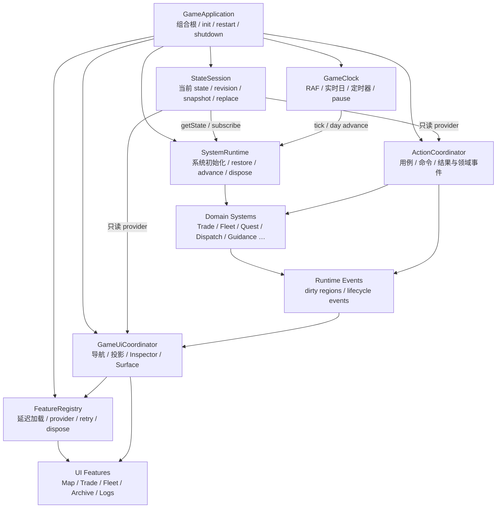
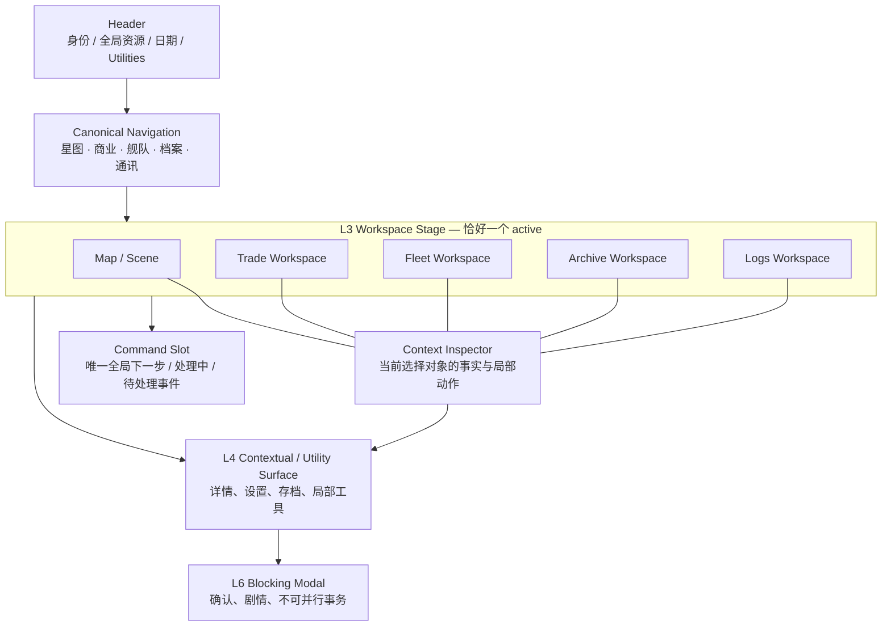

# 《星际贸易商》GameManager 与全局 UI 重构方案

> 文档状态：实施中
> 更新日期：2026-08-13
> 适用范围：`linegame-web` 浏览器单机版运行时架构、全局 UI 壳层与迁移测试
> 关联基线：[`09_技术架构设计.md`](./09_技术架构设计.md)、[`21_全局UI设计规范.md`](./21_全局UI设计规范.md)

## 0. 文档定位

本文把本轮代码审计结论转化为可分阶段验收的实施方案，解决两个已经互相放大的问题：

1. `GameManager` 同时承担组合根、状态会话、系统生命周期、时钟、动作编排、延迟加载和 UI 刷新，任何局部修改都容易影响全局。
2. 当前 UI 以“地图 + 主工作区 + 次级终端 + 多个 HUD 浮窗”叠加，导航、上下文、焦点和信息归属没有单一权威。

本文不是一次性重写计划。实施必须保持可运行、可回滚，每个阶段都先建立契约和测试，再迁移调用方。与文档 21 冲突时：

- 本文对 **L3/L4、五个一级工作区、全局壳层、Navigation、Context Inspector、Surface 与 Escape** 的定义优先。
- 文档 21 的视觉语言、Token、组件状态和可访问性要求继续有效。
- 玩法规则、存档字段和数值平衡不在本次重构范围内。

## 1. 执行结论

目标不是把现有约 2,900 行的文件机械切成多个同样耦合的文件，而是建立七个有明确所有权的运行时对象：

- `GameApplication`：组合根和应用生命周期。
- `StateSession`：当前状态、替换、快照和 revision。
- `SystemRuntime`：领域系统的初始化、恢复、日推进和销毁。
- `ActionCoordinator`：用户动作和用例编排。
- `GameClock`：动画帧、实时日和计时器。
- `FeatureRegistry`：延迟功能、依赖、样式、重试和释放。
- `GameUiCoordinator`：UI 导航、投影刷新、Context Inspector、Command Slot 和 Surface 协调。

迁移结束后，`GameManager.js` 只保留兼容门面和组合代码，目标 **400–600 行**。这个范围是职责护栏，不通过压缩格式或把巨型闭包搬到另一个文件来达成。

## 2. 现状量化

以下数据为 2026-08-13 对当前工作树的静态盘点：

| 对象 | 现状 | 风险含义 |
| --- | ---: | --- |
| `js/core/GameManager.js` | 约 2,900 行 | 已超出单文件可安全推理范围 |
| `GameManager` 静态 import | 41 个 | 组合、业务和 UI 依赖同时进入主模块 |
| `GameManager` 顶层函数 | 152 个 | 大量私有用例和适配逻辑集中 |
| `_handle*` / `_load*` / `_render*` / `_ensure*` 函数 | 76 个 | 动作、加载与视图边界混杂 |
| 延迟模块状态变量 | 24 个 `Module/Promise/Error/Initialized` 变量 | 每个功能重复实现生命周期 |
| `MapUI.js` | 2,371 行 | 地图、导航和上下文 UI 相互渗透 |
| `MarketUI.js` | 3,536 行 | 单一功能工作区过大 |
| `FleetUI.js` | 2,898 行 | 渲染和动作接口数量过多 |
| `HUD.js` | 1,292 行 | 全局状态与上下文状态混放 |
| `SurfaceManager.js` | 498 行 | 已有基础能力，但契约覆盖不完整 |
| 全部 CSS | 33,646 行 | 级联、重复响应式规则和所有权难以追踪 |
| `interstellar-trader.css` | 13,686 行 | 大量遗留全局选择器仍是主要级联源 |

行数不是单独的缺陷；真正问题是这些文件之间不存在稳定的所有权边界。当前一次“载入存档”同时涉及状态指针、系统重初始化、延迟模块同步、教程生命周期和全量 UI 刷新，测试只能通过大量集成桩或源码字符串断言保护行为。

## 3. 已确认的真实缺陷与结构风险

### 3.1 状态替换后存在陈旧引用

`UIManager` 曾在初始化时持有 `_state` 对象。手动读档会替换 `GameManager._state`，但 UI 仍可能读取旧对象。首批修复已把接线改为 `UIManager.init(() => _state, ...)`，证明状态快照不能由长期存活的 UI 模块缓存。

这不是只修一个参数即可永久解决的问题。所有长生命周期对象都必须通过 `StateSession.getState()` 或只读 provider 获取当前状态；异步加载完成后也必须重新读取，而不能使用发起加载时捕获的对象。

### 3.2 冷启动与手动读档生命周期不一致

冷启动路径会初始化教程、平衡指标和中期教学链，手动读档路径曾遗漏这些步骤，导致同一存档通过不同入口进入后产生不同运行时状态。首批修复已在读档成功后补齐：

- `Tutorial.init(_state)`
- `BalanceMetrics.init(_state)`
- `MidgameTeachingChain.init(_state)`

长期方案必须由 `SystemRuntime.restore(session)` 统一顺序，禁止各入口自行复制初始化清单。

### 3.3 延迟功能重复维护状态机

市场、舰队、档案、存档以及胜利、剧情、随机事件、设置、引导等功能分别维护 `module/promise/error/initialized`。重复代码会产生三类差异：并发加载是否合并、失败后能否重试、状态替换后是否重新初始化。

首批 `DeferredFeatureLoader` 已统一市场、舰队、档案和存档四项，但其余延迟功能仍使用旧模式。该模块是 `FeatureRegistry` 的起点，不是最终边界。

### 3.4 导航存在多重所有者

底部导航、地图返回和终端开关分散在 `UIManager`、`MapUI`、功能 UI 与 `SurfaceManager`。现有测试甚至需要专门防止一次点击触发两次切换。这说明“谁决定当前工作区”尚未成为单一事实源。

目标状态中只有 `NavigationController` 可以改变 canonical workspace；旧 DOM 点击处理器只作为适配器调用它。

### 3.5 全量刷新掩盖依赖关系

`_updateUI()` 同时更新 HUD、飞船、地图、已加载终端、派遣和行动引导。它无法表达“动作只使哪些投影失效”，也容易在未加载模块与状态替换之间产生时序错误。

迁移期可以保留 `renderAll()` 作为安全兜底，但新动作必须返回明确的 `dirtyRegions` 或领域事件，最终由 `GameUiCoordinator` 做增量刷新。

### 3.6 UI 层级与产品信息架构冲突

当前把市场称为 Primary Workspace，把机库、档案和日志称为 Secondary Terminal，但它们实际都是一级目的地。产品语义上的不平等迫使实现使用两套互斥和返回逻辑，也让 Escape、焦点恢复和移动端布局不一致。

地图内又并列银河地图、市场概览、当前航点、贸易网络、任务跟踪和星球详情，多个区域竞争“当前上下文”；Header、终端摘要和行动引导还会重复显示同一状态。

### 3.7 Surface 可访问性契约尚不完整

现有 `SurfaceManager` 已具备部分焦点保存、阻塞弹窗 Tab 陷阱和 Escape 关闭能力，但背景 `inert`、跨层级的唯一 Escape 调度、非活动工作区的可聚焦元素隔离仍需统一。功能模块各自监听 `document.keydown` 会造成一次 Escape 关闭多层，或在关闭弹窗后意外跳回地图。

### 3.8 CSS 有分层意图，但尚未形成所有权

项目已有 Token → Primitive → Surface → Responsive 的入口顺序，但 13,686 行遗留主样式和多个大型功能样式仍包含全局选择器、重复 media query 和局部 z-index。只调整加载顺序不能解决级联所有权问题。

## 4. 目标职责架构



箭头表示依赖或调用方向。领域系统不 import UI；Feature 不持有状态快照；`GameApplication` 只组装这些对象，不实现领域规则。

### 4.1 `GameApplication`

唯一职责：

- 创建并注入七个运行时对象。
- 暴露 `init`、`newGame`、`loadGame`、`restart`、`shutdown` 等应用生命周期。
- 处理顶层错误边界和启动诊断。
- 在迁移期维护旧 `GameManager` 导出 API 的兼容门面。

禁止：直接查询 DOM、计算价格、修改任务状态、渲染工作区、维护每个功能的 Promise。

### 4.2 `StateSession`

唯一职责：

- 持有当前 state 指针与单调递增的 `revision`。
- 创建新局、替换读档状态、提供序列化快照。
- 提供 `getState()`、`getRevision()`、`replace()`、`subscribe()`。
- 在替换前后发布 `session:replacing` / `session:replaced`。

约束：订阅者可以保存 revision，不可以永久保存可变 state 引用；异步回调执行前必须比对 revision 或重新获取 state。

### 4.3 `SystemRuntime`

唯一职责：

- 按声明顺序执行领域系统的 `initialize`、`restore`、`capture`、`advanceDay`、`dispose`。
- 把冷启动、重新开始和手动读档收敛到同一个生命周期表。
- 隔离有运行时缓存的系统与纯函数系统。
- 保证同一 session revision 只初始化一次。

系统清单必须是数据，而不是分散在多个处理函数中的调用序列。

### 4.4 `ActionCoordinator`

唯一职责：

- 接收 UI 意图，例如 `trade.buy`、`travel.start`、`quest.accept`。
- 校验前置条件并调用一个或多个领域系统。
- 返回统一结果：`{ ok, code, message, events, dirtyRegions, focusTarget }`。
- 将跨系统事务的补偿或失败边界集中处理。

禁止：显示弹窗、查找 DOM、直接切换工作区。需要 UI 反馈时返回语义结果，由 UI 层解释。

### 4.5 `GameClock`

唯一职责：

- 管理 RAF、实时日期推进、派遣计时和暂停状态。
- 提供 `start`、`pause`、`resume`、`reset`、`dispose`。
- 接收可注入的 `now`、`requestFrame` 和 scheduler，支持假时钟测试。
- 重启、读档和页面隐藏时不得遗留旧计时器。

### 4.6 `FeatureRegistry`

唯一职责：

- 以 manifest 声明功能的 JS、CSS、依赖和生命周期。
- 合并并发加载，记录 `idle/loading/ready/error/disposed`。
- 失败后可重试；初始化失败不能标记为 ready。
- 在 session 替换时调用 `sync`，在应用关闭时 `dispose`。
- 提供诊断快照，不依赖散落的 `body.dataset` 作为事实源。

`DeferredFeatureLoader` 作为第一版实现继续演进，禁止为新功能重新增加独立的 module/promise/error 三元组。

### 4.7 `GameUiCoordinator`

唯一职责：

- 连接 Navigation、Context Inspector、Command Slot 和 Surface stack。
- 从 `StateSession` provider 获取最新状态，生成 UI 投影。
- 按 `dirtyRegions` 更新；迁移期提供 `renderAll()`。
- 在用户首次进入工作区时向 `FeatureRegistry` 请求功能。
- 把动作回调按领域端口注入 UI Feature。

禁止：实现交易或任务规则；直接 import 所有延迟 Feature；保存长期 state 快照。

## 5. GameManager A–F 拆分计划

每阶段都必须能单独合入、回滚并保持主流程可玩。只有完成本阶段验收后才能删除旧路径。

### A. 契约冻结与可观测基线

实施内容：

- 为启动、新局、重开、自动存档、手动存档和手动读档建立生命周期矩阵。
- 固化动作结果、runtime 事件、dirty region 与 Feature manifest 的 JSDoc 契约。
- 记录当前 listener、timer、动态 import 和 Surface 数量，增加开发环境诊断快照。
- 保留现有 UI 和 DOM，不做视觉改版。

验收：

- 六条生命周期路径均有集成测试。
- 同一操作的系统初始化顺序可被断言。
- 重复 `init/restart/load` 不增加 listener 或 timer。
- 当前用户可见行为与阶段开始前一致。

### B. 提取 `StateSession` 与 `FeatureRegistry`

实施内容：

- 以 `StateSession` 替代全局 `_state` 的跨模块传播。
- 将首批 `DeferredFeatureLoader` 扩展为 manifest 驱动的 `FeatureRegistry`。
- 先迁移市场、舰队、档案、存档，再迁移胜利、剧情、随机事件、设置、教程、引导、商业运行时和成就。
- 所有 Feature 初始化接收 provider 或 session context。

验收：

- 读档替换后，已加载和加载中的 Feature 都读取新状态。
- 并发加载只执行一次；失败可重试；dispose 后可重新加载。
- `GameManager` 不再存在按功能复制的 module/promise/error 三元组。
- 初始 bundle 不意外包含延迟 Feature。

### C. 提取 `SystemRuntime` 与 `GameClock`

实施内容：

- 把冷启动、重新开始和读档后的系统初始化收敛到 runtime manifest。
- 把 RAF、实时日、派遣时钟与暂停逻辑迁入 `GameClock`。
- 为有缓存的系统实现 restore/capture/dispose。

验收：

- 冷启动与手动读档执行同一份系统清单。
- Tutorial、BalanceMetrics 和 MidgameTeachingChain 不再由入口函数单独补调用。
- 使用假时钟可确定性验证跨日、暂停与恢复。
- 连续重开、连续读档后只有一个有效 clock。

### D. 提取 `ActionCoordinator`

实施内容：

- 按 `trade`、`travel`、`fleet`、`quest`、`research`、`dispatch`、`guidance` 分组迁移 `_handle*`。
- 把确认、失败原因、事件和刷新区域编码到统一动作结果。
- 将 UI 需要的动作端口集中注入，不再传递超长位置参数链。

验收：

- `GameManager` 不直接改变领域字段。
- 每组动作有纯单元测试和至少一条跨系统集成测试。
- 失败动作不产生部分写入；成功动作声明准确的 dirty region。
- UI 可以使用同一结果模型显示 toast、阻塞确认和焦点目标。

### E. 提取 `GameUiCoordinator` 并迁移新 IA

实施内容：

- 接线唯一 NavigationController、ContextInspectorController 和 Surface stack。
- 建立 Header、Workspace Stage、Context Inspector、Command Slot 和五个 canonical workspaces。
- 逐一把旧市场、机库、档案、日志 DOM 接到工作区适配器。
- 将 `_updateUI()` 改为 coordinator 的兼容入口，再迁移到增量刷新。

验收：

- 任意时刻恰好一个 canonical workspace active。
- 重复点击当前导航项为幂等操作，不折叠、不隐式返回地图。
- 非活动工作区不可见、不可聚焦且 inert。
- Focus、Escape、阻塞弹窗与详情层符合第 9 节契约。
- 桌面和移动端都不再使用 Primary/Secondary 两套一级导航语义。

### F. 收口组合根与清理兼容层

实施内容：

- `GameApplication` 成为真实组合根，`GameManager` 仅保留公共门面。
- 删除重复绑定、旧 Feature 状态机、旧导航 fallback 和无调用的兼容选择器。
- 完成 CSS 分层迁移和五视口浏览器验收。
- 补充架构依赖检查，禁止领域层 import UI。

验收：

- `GameManager.js` 为 **400–600 行**，只包含 import、组装、生命周期和兼容导出。
- 文件中无领域状态写入、无工作区渲染、无直接 DOM 查询、无独立 timer。
- 全量单元/集成测试、生产构建和五视口 QA 通过。
- 没有未登记的 document 级事件监听器或 z-index。

## 6. 新全局信息架构



### 6.1 壳层构成

1. **Header**：只展示跨工作区仍然成立的身份和关键资源；设置、存档、胜利进度作为 utility 入口，不成为一级工作区。
2. **Map / Workspace Stage**：地图是五个工作区之一，也是默认工作区；其它工作区在同一 stage 中替换它，而不是作为不同等级的弹层盖住它。
3. **Context Inspector**：唯一的“当前选中对象”区域。地图中的星球、航线，商业中的商品，舰队中的飞船，档案中的任务都使用同一上下文协议。
4. **Command Slot**：唯一全局“下一步”与进行中行动区域。事件通知、教学建议和动作处理状态必须在这里仲裁，不再各占一个浮窗。
5. **Canonical Navigation**：五个平级目的地，任意时刻恰好一个 active。

### 6.2 五个 canonical workspaces

为兼容已落地的 `NavigationController` 骨架，canonical code id 定为：

| code id | 用户术语 | 旧入口别名 | 唯一职责 |
| --- | --- | --- | --- |
| `map` | 星图 | `starmap` | 位置、航线、星球选择、旅行目标 |
| `trade` | 商业 | `market` | 价格、买卖、订单、金融和站点商业 |
| `fleet` | 舰队 | `hangar` | 舰船、船员、改装、维护和派遣 |
| `archive` | 档案 | `quests` | 任务、探索、研究、派系和成就 |
| `logs` | 通讯 | `console` | 日志、剧情对话、消息和历史通知 |

旧别名只允许在 DOM/存档书签等适配边界归一化；核心状态、测试和新代码必须使用 canonical id。`settings`、`save`、`victory` 不是 workspace。

## 7. L3 / L4 重定义

文档 21 中“L3 Primary Workspace / L4 Secondary Terminal”的产品等级在本方案中废止，替换为：

| 层级 | 新名称 | 内容 | 互斥与生命周期 |
| --- | --- | --- | --- |
| L0 | Scene | WebGL/2D 世界背景 | 随工作区策略保持或暂停 |
| L1 | Global Shell | Header、canonical nav | 常驻；阻塞弹窗时 inert |
| L2 | Context & Command | Context Inspector、Command Slot、非阻塞状态 | 随 active workspace 更新 |
| **L3** | **Canonical Workspace** | `map/trade/fleet/archive/logs` | 恰好一个 active；平级切换 |
| **L4** | **Contextual / Utility Surface** | 对象详情、局部 drawer/sheet、设置、存档等工具 | 位于当前 L3 之上；按 stack 管理；不是一级导航 |
| L5 | Non-blocking Feedback | Toast、短暂事件反馈 | 不夺焦点、不覆盖主操作 |
| L6 | Blocking Modal | 交易确认、剧情决策、破坏性确认 | 同时一个；锁定焦点和背景 |
| L7 | Guided Overlay | 强制教学聚焦 | 最高交互优先级，显式开始/结束 |

迁移期间可以保留 `#market-overlay`、`#trade-panel`、`#info-panel`、`#console-panel` 等旧 ID，但它们的语义已是 L3 workspace adapter。不得继续根据“primary/secondary”给五个工作区设置不同关闭规则。

## 8. 信息唯一归属与术语

### 8.1 信息所有权

| 信息 | 权威位置 | 允许的摘要 | 禁止重复 |
| --- | --- | --- | --- |
| 公司名、信用点、日期、关键舰船资源 | Header | 阻塞交易内可显示交易后余额 | 各工作区重复完整全局 HUD |
| 当前星球、航线、商品、飞船、任务的详情 | Context Inspector | 列表行可显示识别所需摘要 | 多个地图浮窗同时声明“当前” |
| 全局下一步、待确认事件、动作处理中/完成 | Command Slot | 控件就地 loading/error | Header、任务卡和 toast 同时给下一步 |
| 位置、航行目标、星系关系 | Map | Inspector 显示当前选择 | 商业工作区复制完整地图状态 |
| 价格、库存、订单、金融 | Trade | Header 仅保留信用点 | Map 的常驻市场概览复制全表 |
| 舰船、船员、改装、维护、派遣 | Fleet | Header 仅显示当前舰关键告警 | Archive 重复舰队管理动作 |
| 任务、研究、探索、派系、成就 | Archive | Command Slot 可引用一个当前目标 | 多个常驻任务跟踪器竞争焦点 |
| 日志、对话、消息历史 | Logs | Toast 只显示短暂摘要 | 日志内容在多个终端永久复制 |

同一数据在第二位置出现时，必须回答“这个摘要支持什么当前决策”。没有答案就删除摘要。

### 8.2 术语表

- **工作区 / Workspace**：只指 L3 五个一级目的地。
- **星图、商业、舰队、档案、通讯**：面向玩家的固定名称，不混用“市场页/交易终端”“机库页”“任务页/信息面板”“控制台/日志页”。
- **Context Inspector / 上下文检查器**：当前选择对象的事实与局部动作，不称“HUD 卡片”或“详情弹窗”。
- **Command Slot / 行动槽**：唯一全局下一步、处理中和待处理事件位置，不再同时使用“行动建议”“任务提示”“下一目标”等全局术语。
- **Surface**：内部交互容器契约，不作为玩家可见标题。
- **Modal / 模态框**：仅指 L6 阻塞流程；非阻塞详情不能称为 modal。
- **Terminal / 终端**：可以保留为视觉叙事词，但不表达导航层级。

## 9. 交互与可访问性契约

### 9.1 Navigation 契约

最小状态：

```js
{
  workspaceId: 'map' | 'trade' | 'fleet' | 'archive' | 'logs',
  detailStack: Array<ContextKey>,
  revision: number
}
```

规则：

1. 只有 NavigationController 能改变 `workspaceId`。
2. `navigate(id, metadata)` 对非法 id 和当前 id 必须是无副作用 no-op。
3. 工作区切换顺序固定为 `beforeLeave → state commit → afterEnter → publish → focus`。
4. 每次有效切换读取最新 `StateSession`，不携带旧 state 快照。
5. 点击当前导航项不得关闭工作区或跳回地图；地图必须通过显式 `map` 导航进入。
6. 旧别名仅在 adapter 调用 `normalizeWorkspace` 时接受。
7. 工作区加载失败时仍保留导航状态，stage 显示可重试错误，不偷偷回退到另一个工作区。

### 9.2 Context Inspector 契约

上下文使用可辨识记录：

```js
{
  type: 'planet' | 'route' | 'commodity' | 'ship' | 'quest' | 'message',
  id: string,
  workspaceId: string,
  source: string,
  revision: number
}
```

规则：

- Inspector 只保存 context key，不保存领域对象副本；渲染时从最新 state 投影。
- `replaceContext` 是幂等操作，`clearContext` 只清当前工作区上下文。
- 每个工作区可保留自己的 detail stack，切回时恢复选择；读档后无法解析的 key 自动清理。
- 桌面默认 dock，窄屏默认 bottom sheet；两者使用同一状态和动作集合。
- Inspector 展示事实、比较和局部动作，不承载全局下一步或完整工作区列表。

### 9.3 Surface 契约

所有 L4–L7 容器必须注册：

```js
{
  id,
  layer,
  kind,
  dismissible,
  ownerWorkspace,
  triggerElement,
  initialFocus,
  returnFocus
}
```

规则：

- `open`、`close` 必须幂等；显示状态只能由 Surface manager 修改。
- 功能模块不得直接切换通用 `.active/.hidden` 来绕过 stack。
- manager 提供可测试快照：active workspace、stack、blocking surface、focus owner。
- 关闭拥有子层的 Surface 时必须先从顶层向下关闭。
- L4 是上下文/工具层，不得改变 canonical workspace 的 active 状态。

### 9.4 Focus 契约

- 切换工作区后，焦点进入工作区标题、选中 tab 或声明的主要输入；不得落到 `body`。
- 打开 L4 时焦点进入其标题或首要控件；非阻塞 L4 不默认设置全局 Tab trap。
- 打开 L6/L7 时锁定焦点；Tab 与 Shift+Tab 在有效可见控件间循环。
- 关闭后优先恢复触发元素；触发元素已不存在时依次回退到 owner workspace 标题、active nav item。
- `hidden`、`aria-hidden="true"` 或 `inert` 子树内的元素不得成为 programmatic focus target。
- 鼠标点击、键盘激活和程序导航使用同一 focus policy。

### 9.5 `inert` 与可见性契约

- 非 active L3 同时设置 `hidden`、`aria-hidden="true"` 和 `inert`；active L3 移除三者。
- L6/L7 打开时，除顶层容器外的 Global Shell、L2、L3 和较低 Surface 全部 inert。
- 仅设置 `opacity: 0`、`pointer-events: none` 或移出屏幕不等于隐藏。
- 若目标浏览器不支持原生 `inert`，使用集中 polyfill/fallback 管理 `tabindex`；功能模块不得自行实现不同版本。

### 9.6 Escape 契约

只允许一个 document 级 Escape dispatcher。一次按键最多执行一个动作，优先级为：

1. L7 Guided Overlay 明确允许的退出动作。
2. 顶层可关闭 L6 Blocking Modal。
3. 顶层可关闭 L4 Surface 或当前 workspace 的 detail。
4. 收起窄屏 Context Inspector。
5. 无可关闭层时不处理。

Escape **不得切换 canonical workspace 或默认返回地图**，也不得关闭标记为 `dismissible: false` 的事务。当前 `NavigationController` 骨架仍包含“非地图 Escape 返回地图”的过渡行为，在正式接线前必须删除，并把详情关闭交给统一 dispatcher。

## 10. 响应式壳层

### 10.1 布局原则

- 宽屏：Header 顶部；canonical nav 可在底部或侧边；Workspace Stage 占主区；Inspector 右侧 dock；Command Slot 靠近主操作但不遮地图。
- 中等宽度：Inspector 变为可折叠侧栏；Header 只保留关键资源，次级指标进入 utility popover。
- 窄屏：Workspace 全屏；Inspector 使用 bottom sheet；Command Slot 固定在 nav 之上并尊重安全区；Header 变为两行以内的紧凑栏。
- 移动端不允许把桌面五列压缩；列表、图表和操作区必须重新编排。
- WebGL 地图不可用时保留 2D fallback，导航和 Inspector 契约不变。

### 10.2 五视口浏览器 QA

以下五个视口是每个 E 阶段 PR 的固定验收矩阵：

| 视口 | 代表设备 | 必查项 |
| --- | --- | --- |
| `1440 × 900` | 标准桌面 | Inspector dock、地图无遮挡、五工作区切换、L4/L6 stack |
| `1280 × 720` | 紧凑笔记本 | Header 高度、纵向空间、终端内部滚动、Command Slot 不遮 CTA |
| `1024 × 768` | 横向平板 | 折叠 Inspector、触控目标、图表与列表最小宽度 |
| `768 × 1024` | 纵向平板 | sheet 行为、软键盘前焦点、nav 安全区、Surface 返回焦点 |
| `390 × 844` | 移动端 | 单列重排、Header 压缩、bottom sheet、无横向溢出、44px 触控目标 |

每个视口至少执行：

1. 新局进入地图。
2. 依次进入五个工作区并重复点击当前项。
3. 选择一个对象、打开两层详情、逐层关闭。
4. 打开 L6，使用 Tab/Shift+Tab/Escape，再验证焦点恢复。
5. 模拟延迟 Feature 首次加载失败并重试。
6. 手动读档后确认 Header、Inspector、已打开 Feature 都显示新状态。
7. 检查 2D fallback、200% 缩放、键盘导航和无横向页面滚动。

浏览器 QA 记录必须包含浏览器版本、视口、WebGL/2D 模式、失败截图和复现步骤；“肉眼看过首页”不算通过。

## 11. 测试策略

### 11.1 纯契约测试

- `StateSession`：replace、revision、订阅顺序、陈旧异步结果丢弃。
- `FeatureRegistry`：并发合并、依赖顺序、初始化失败、重试、sync、dispose。
- `NavigationController`：唯一 active、别名归一化、幂等、独立 detail stack。
- `ContextInspectorController`：key 解析、跨工作区恢复、读档失效清理。
- `GameClock`：假时间、暂停、恢复、重复启动和销毁。
- `ActionCoordinator`：成功/失败原子性、领域事件和 dirty region。

### 11.2 集成测试

建立统一场景表：

- 冷启动 → 新局 → 首次渲染。
- 重新开始 → 旧 runtime 完整 dispose → 新 session 初始化。
- 自动/手动保存 → 手动读档 → 所有 provider 指向新状态。
- Feature 正在加载时读档，加载完成后渲染新 state。
- 动作 → 领域事件 → 指定 UI 投影更新，不依赖全量刷新。
- 五工作区切换 → 详情 → 阻塞弹窗 → 关闭后恢复上下文和焦点。

### 11.3 DOM 与可访问性测试

- 每次导航断言仅一个 active L3，其他节点具有 `hidden/aria-hidden/inert`。
- Surface stack 断言 z-order、dismissible、焦点 trap 和 return focus。
- 单次 Escape 只关闭最顶层一个对象。
- active nav 使用 `aria-current`；tab/toolbar 使用正确 role，不用 CSS class 代替语义。
- 无障碍名称、错误关联、loading/busy/live region 均有行为断言。

### 11.4 浏览器与构建测试

- 使用浏览器自动化覆盖第 10.2 节五视口主路径，并保留少量稳定截图基线。
- 对 WebGL 与 2D fallback 各跑一条地图 smoke。
- 检查初始 bundle 未静态包含延迟 Feature，CSS manifest 顺序稳定。
- 记录重复 listener、未释放 timer 和 Detached DOM 的开发诊断。

### 11.5 测试迁移原则

现有 `deferredUiLoading.test.js` 等包含部分源码字符串断言，可在过渡期防回归，但最终必须由模块行为测试替代。测试应该验证“并发只加载一次、失败可重试、读档后用最新 state”，而不是验证私有变量名或某一行源码仍存在。

阶段合入最低门槛：相关单测 + 生命周期集成 + 生产构建；E/F 阶段额外要求五视口浏览器 QA。

## 12. CSS 分层迁移

### 12.1 目标层级

统一声明 cascade layers：

```css
@layer reset, tokens, base, primitives, shell, surfaces, features, utilities, legacy;
```

| 层 | 所有权 | 示例目标文件 |
| --- | --- | --- |
| `reset` | 浏览器差异归一化 | `reset.css` |
| `tokens` | 颜色、空间、字号、z-index、安全区 | `tokens.css` |
| `base` | body、排版、默认可访问性 | `base.css` |
| `primitives` | Button、Field、Tabs、List、Badge | `primitives/*.css` |
| `shell` | Header、Workspace Stage、nav、Inspector、Command Slot | `app-shell.css`、`navigation.css`、`context-inspector.css`、`command-slot.css` |
| `surfaces` | L4–L7 容器与状态 | `surfaces.css`、`modals.css` |
| `features` | Map/Trade/Fleet/Archive/Logs 私有样式 | `features/*.css`，随 Feature manifest 加载 |
| `utilities` | 少量单用途辅助类 | `utilities.css` |
| `legacy` | 尚未迁移的兼容选择器 | 现有大型 CSS，优先级受控 |

### 12.2 迁移步骤

1. 生成选择器、DOM 引用、媒体查询和 z-index 清单，标记 owner 与测试覆盖。
2. 先引入 layer 和壳层新文件，不改变视觉。
3. 按组件从 `interstellar-trader.css` 搬迁；每次只迁一个 owner，并进行五视口差异检查。
4. 将 Feature 样式登记到 `FeatureRegistry`，避免重复 `<link>` 和错误加载顺序。
5. 合并重复 media query；壳层响应式归 shell，功能响应式归 feature，优先使用 container query。
6. 删除已无 DOM/JS 引用的 legacy 规则，最后再移除空文件。

### 12.3 CSS 验收护栏

- 新 Feature 不得使用无命名空间的全局元素/通用类选择器。
- 新 z-index 只能引用层级 Token，禁止散落魔法数字。
- `!important` 只能出现在登记过的 legacy 兼容项，并附删除阶段。
- 隐藏交互元素必须同时满足可见性与可访问性契约，不能只靠 CSS。
- 不以一次性大规模格式化伪装迁移；每个 PR 要能指出删除了哪些旧 owner。

## 13. 首批修复与新模块接线状态

本节记录 2026-08-13 工作树中的真实状态。“已落盘”不等于全部迁移完成或已经发布。

| 项目 | 当前状态 | 已覆盖 | 下一步 |
| --- | --- | --- | --- |
| `DeferredFeatureLoader` | **已落盘并接入首批功能** | 市场、舰队、档案、存档；并发复用、失败重试、初始化失败、延迟 CSS 有测试 | 演进为 manifest `FeatureRegistry`；迁移其它延迟功能；补 dispose/dependency/session sync |
| `StateSession` | **第一阶段已接入** | state/revision/token/replace；`GameManager` 只经 session 替换状态；UIManager 与 MapUI 使用最新 state provider；订阅者异常隔离 | 将 legacy `_state/_runtimeRevision` 全面改为 session 读取 |
| `GameSystemRuntime` | **第一阶段已接入** | 冷启动与手动读档共用 restore manifest；保存共用 fleet/economy/galaxy capture；Tutorial 等不再由入口补调用 | 增加 dispose/advance 与失败回滚；补六路径生命周期矩阵 |
| `GameSessionLifecycle` | **第一阶段已接入** | 冷启动、自动存档恢复、重开与手动读档共用 stop → replace → restore → project → render → resume 编排；支持 UI 壳就绪前的两阶段启动、stale token 丢弃、幂等 present 与失败停表 | 增加 restore 失败回滚和 shutdown；补浏览器级保存/读档矩阵与 timer/listener 计数 |
| `GameClockController` | **已接入全部游戏计时器** | RAF、实时日与 active dispatch recurring task 统一所有权；假时钟、暂停不补算、重复 start、会话替换和 dispose 有测试 | 接入页面可见性生命周期与统一 runtime dispose；把 dispatch tick 动作编排迁入 ActionCoordinator |
| `FleetActionController` | **已接入全部舰队 UI 动作** | 购船、切船、升级、派遣/召回、槽位、出售、改装、保养和船员动作统一编排；保持系统 mutation、飞行动画、dispatch、计时器、任务/教学进度与反馈顺序；每次动作读取最新 state provider | 将 active dispatch tick 与舰队日结算纳入同一 action pipeline；移除 GameManager 兼容转发函数 |
| `CommerceOperationsController` | **已接入全部经营/金融 UI 动作** | 建站、升级、策略、批量商网、贷款、还款、投资和赎回统一编排；延迟 runtime 未就绪返回可重试结果；批量输入、任务/教学副作用和 latest-state provider 有测试 | 将经营模块并入 FeatureRegistry dependency graph；把 stock/futures/insurance 动作从 facade 回调继续收口 |
| `GameUiCoordinator` | **首批已接入 `GameManager`** | provider、四项 Feature ensure/render、命名 action 分组、`renderAll` 兼容刷新 | 缩短位置参数；引入 dirty regions；逐步淘汰兼容刷新 |
| `NavigationController` | **已接入 `UIManager`** | 五个 workspace、旧别名、唯一 active、幂等切换、独立 detail stack；Escape 只关闭 L4 详情不改变 L3 | 继续迁移旧 surface 直接开关与 focus 适配器 |
| `SurfaceManager` | **唯一 Escape dispatcher 已接入** | blocking 层优先且不下穿；非阻塞层按优先级处理；隐藏 surface 同步 inert/aria-hidden | 将五个 L3 workspace 完全收口到同一 surface registry |
| `ContextInspector` | **四个对象型 workspace 已接入** | 每 workspace 的不可变 context key、latest-state provider、renderer adapter、统一空态；地图、商品、舰船、任务、科技、派系、成就与探索报告已接入；桌面 dock 与窄屏 bottom sheet 已完成多视口回归 | 补 logs/message 只读 adapter；把局部动作进一步移入 inspector action slot |

当前仍存在的过渡边界：

- `GameManager` 仍为约 2,900 行；StateSession、SystemRuntime、SessionLifecycle 与 GameClock 已成为真实调用路径，但动作编排仍未迁出，尚未达到薄组合根目标。
- `GameUiCoordinator`、`NavigationController`、`SurfaceManager` 和 `ContextInspector` 已进入运行时调用链；非地图对象 adapter 和 Inspector focus 转移已接通，但 logs/message adapter 与增量刷新尚未收口，不能按“已完成 UI 重构”验收。
- 多个延迟模块仍保留旧三元状态机。
- `SurfaceManager` 已统一 blocking 层、inert 与 Escape dispatcher，但五个 L3 workspace 仍需淘汰旧 primary/secondary 适配分歧。
- 新模块不得长期停留为旁路实现；每个骨架必须有接线阶段和删除旧路径的验收项。

## 14. 兼容、风险与回滚

### 14.1 主要风险

| 风险 | 控制措施 |
| --- | --- |
| 状态替换期间旧异步任务回写新 session | revision 校验；dispose 旧 runtime；异步完成时重新取 state |
| 新旧导航同时绑定造成双切换 | 先让旧 handler 只调用 controller，再删除 direct DOM 切换；增加 listener 计数断言 |
| Feature 加载失败导致空白工作区 | active 状态不回退，显示可重试 error surface；保留上下文和焦点 |
| Surface 迁移破坏键盘和弹窗 | 先建立 stack/focus/inert/Escape 行为测试，再换 DOM owner |
| CSS layer 改变优先级产生大面积视觉漂移 | 单 owner 迁移、五视口截图、legacy 层临时兜底 |
| 为追求行数制造新“God module” | 架构依赖检查 + 每个对象职责/禁止项评审 |

### 14.2 兼容策略

- 旧公共 API 通过 `GameManager` facade 转发，调用方逐批迁移。
- 旧 DOM ID 在 E 阶段保留，使用 workspace adapter 解释新语义。
- 旧 workspace 名称只在 `normalizeWorkspace` 接受，不进入核心状态。
- `renderAll()` 在增量刷新稳定前作为兜底，但要记录调用来源并逐步归零。
- 每个阶段删除旧路径前保留一个可独立回滚的提交点，不同时重写架构和视觉。

## 15. 最终完成定义

全部满足以下条件，文档状态才可从“实施中”改为“已实施”：

- `GameManager.js` 400–600 行，只有组合、生命周期和兼容门面。
- 七个目标对象均有单一职责、公共契约、单测和 dispose 路径。
- 冷启动、重开和读档走同一 runtime 生命周期。
- 所有延迟功能归 `FeatureRegistry`，不存在散落三元状态机。
- 五个 canonical workspaces 平级且恰好一个 active。
- Header、Context Inspector、Command Slot 的信息所有权无重复。
- L3/L4、Navigation、Surface、focus、inert 和 Escape 契约全部有行为测试。
- 五个固定视口、WebGL/2D、键盘与 200% 缩放 QA 通过。
- CSS 具备明确 cascade layer 和 owner；遗留规则有可追踪删除计划。
- 全量测试和生产构建通过，未出现重复 listener、孤儿 timer 或陈旧 state 回写。

---

本方案的核心判断是：先让状态、生命周期、动作、功能和 UI 各自拥有唯一事实源，再调整视觉布局。只改文件位置而不改变所有权，会保留今天的缺陷；只改 UI 外观而不统一 Navigation 与 Surface，也会继续制造双重状态。A–F 阶段必须同时以代码边界和用户可观察行为作为验收依据。
